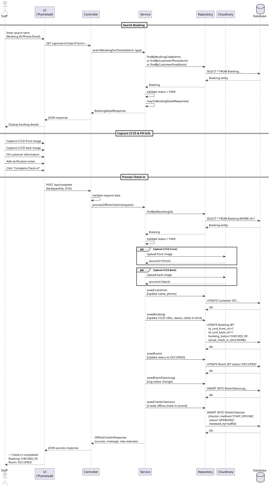

# Staff Offline Check-in Design Document

## 1. PROBLEM ANALYSIS

### Current System Flow
```
Customer → Room Detail → Booking → Payment → Self Check-in (Video Upload) → Admin Approval → Checked In
                                                      ↓
                                                   KYC Fails
                                                      ↓
                                            BOOKING BLOCKED ❌
```

### Pain Points
1. **Customer doesn't have CCCD at moment** → Cannot complete check-in
2. **Camera/upload technical issues** → Frustrated customer experience
3. **Poor lighting/video quality** → Admin rejects check-in
4. **No fallback option** → Payment complete but cannot check-in

### Business Impact
- Lost revenue (customer cancels)
- Poor customer satisfaction
- Front desk staff powerless to help

---

## 2. PROPOSED SOLUTION

### New Workflow
```
Customer → Booking (Without KYC) → Payment → [Option 1 or 2]

Option 1: Self Check-in (Video Upload) → Admin Approval ✓
Option 2: Arrive at Property → Staff Offline Check-in ✓
```

### Staff Offline Check-in Flow
```
Staff Dashboard → Search Booking → View Details → Capture CCCD → Verify Info → Complete Check-in
```

**Key Innovation**: Customers can complete booking WITHOUT full KYC. Staff verifies identity at reception desk during arrival.

---

## 3. UI WIREFRAME - STAFF CHECK-IN PAGE

### Page Layout (Desktop)

```
┌─────────────────────────────────────────────────────────────────────────┐
│  ☰ Sidebar      [LOGO] BookNow Staff Portal              [User] Admin  │
├─────────────────────────────────────────────────────────────────────────┤
│                                                                         │
│  ┌─────────────────────────────────────────────────────────────────┐  │
│  │  📝 OFFLINE CHECK-IN                                            │  │
│  │                                                                 │  │
│  │  Search Booking:                                               │  │
│  │  [________________]  [By: Booking ID ▼]  [🔍 Search]         │  │
│  │                                                                 │  │
│  └─────────────────────────────────────────────────────────────────┘  │
│                                                                         │
│  ┌─────────────────────────────────────────────────────────────────┐  │
│  │  📋 BOOKING INFORMATION                                         │  │
│  │  ─────────────────────────────────────────────────────────────  │  │
│  │                                                                 │  │
│  │  Booking #BK-2026-001            Status: 💳 PAID               │  │
│  │  Customer: Nguyen Van A          Phone: 0909 123 456          │  │
│  │  Email: nguyenvana@gmail.com                                   │  │
│  │  Room: 101 - Standard Single     Check-in: 24/01/2026 14:00   │  │
│  │                                                                 │  │
│  │  ⚠️ Missing: CCCD Images                                       │  │
│  │                                                                 │  │
│  └─────────────────────────────────────────────────────────────────┘  │
│                                                                         │
│  ┌───────────────────────────┐  ┌─────────────────────────────────┐  │
│  │  📷 CAPTURE CCCD           │  │  ✏️ CUSTOMER INFORMATION        │  │
│  │  ──────────────────────    │  │  ──────────────────────────────  │  │
│  │                           │  │                                 │  │
│  │  ┌─────────────────────┐ │  │  Full Name:                    │  │
│  │  │                     │ │  │  [____________________]         │  │
│  │  │   [Camera Feed]     │ │  │                                 │  │
│  │  │                     │ │  │  CCCD Number:                   │  │
│  │  │   [Front Side]      │ │  │  [____________________]         │  │
│  │  │                     │ │  │                                 │  │
│  │  └─────────────────────┘ │  │  Date of Birth:                │  │
│  │                           │  │  [____________________]         │  │
│  │  [📸 Capture Front]       │  │                                 │  │
│  │                           │  │  Address:                       │  │
│  │  ┌─────────────────────┐ │  │  [____________________]         │  │
│  │  │   [Camera Feed]     │ │  │  [____________________]         │  │
│  │  │   [Back Side]       │ │  │                                 │  │
│  │  └─────────────────────┘ │  │                                 │  │
│  │                           │  │  Verification Notes:            │  │
│  │  [📸 Capture Back]        │  │  [____________________]         │  │
│  │                           │  │  [____________________]         │  │
│  │  [📁 or Upload Files]     │  │                                 │  │
│  │                           │  │                                 │  │
│  └───────────────────────────┘  └─────────────────────────────────┘  │
│                                                                         │
│  ┌─────────────────────────────────────────────────────────────────┐  │
│  │                                                                 │  │
│  │  [❌ Cancel]              [✅ COMPLETE CHECK-IN]               │  │
│  │                                                                 │  │
│  └─────────────────────────────────────────────────────────────────┘  │
│                                                                         │
└─────────────────────────────────────────────────────────────────────────┘
```

### Key UI Features

1. **Search Panel**
   - Search by: Booking ID, Phone, Email
   - Real-time search results
   - Display booking status badge

2. **Booking Information Panel**
   - Read-only booking details
   - Visual indicators for missing data
   - Booking status with color codes

3. **CCCD Capture Panel**
   - Live camera feed preview
   - Capture front and back separately
   - Alternative: File upload button
   - Preview captured images before submit

4. **Customer Info Form**
   - Pre-filled with existing data
   - Editable fields for missing info
   - Validation on all fields
   - Notes field for special remarks

5. **Action Buttons**
   - Cancel (goes back)
   - Complete Check-in (validates and submits)

---

## 4. TECHNICAL ARCHITECTURE

### N-Layer Architecture

```
┌────────────────────────────────────────────────────────────────┐
│                        VIEW LAYER                              │
│  staff_offline_checkin.html (Thymeleaf)                       │
│  - Search UI                                                   │
│  - Camera capture component                                    │
│  - Customer info form                                           │
└────────────────────────────────────────────────────────────────┘
                            ↕ HTTP/REST
┌────────────────────────────────────────────────────────────────┐
│                     CONTROLLER LAYER                           │
│  OfflineCheckinController.java                                │
│  - searchBooking()                                             │
│  - getBookingDetails()                                          │
│  - uploadCCCDImages()                                           │
│  - completeOfflineCheckin()                                     │
└────────────────────────────────────────────────────────────────┘
                            ↕ DTOs
┌────────────────────────────────────────────────────────────────┐
│                      SERVICE LAYER                             │
│  OfflineCheckinService.java                                   │
│  - searchBookingByIdOrPhoneOrEmail()                           │
│  - uploadCCCDToCloudinary()                                     │
│  - validateCustomerInfo()                                       │
│  - processOfflineCheckin()                                      │
│  - updateBookingAndRoomStatus()                                 │
│  - createRoomStatusLog()                                        │
└────────────────────────────────────────────────────────────────┘
                            ↕ Entities
┌────────────────────────────────────────────────────────────────┐
│                    REPOSITORY LAYER                            │
│  BookingRepository.java                                        │
│  CustomerRepository.java                                       │
│  RoomRepository.java                                            │
│  CheckInSessionRepository.java                                 │
│  RoomStatusLogRepository.java                                  │
└────────────────────────────────────────────────────────────────┘
                            ↕ JPA/Hibernate
┌────────────────────────────────────────────────────────────────┐
│                      DATABASE LAYER                            │
│  - Booking table                                                │
│  - Customer table                                               │
│  - Room table                                                   │
│  - CheckInSession table                                         │
│  - RoomStatusLog table                                          │
└────────────────────────────────────────────────────────────────┘
```

### External Services

```
┌────────────────────────────────────────────────────────────────┐
│                   CLOUDINARY SERVICE                           │
│  - Upload CCCD front image                                      │
│  - Upload CCCD back image                                       │
│  - Return secure URLs                                           │
│  - Image transformation/optimization                            │
└────────────────────────────────────────────────────────────────┘
```

---

## 5. DATA MODEL CHANGES

### No New Tables Needed! ✅

We reuse existing tables with slight adjustments:

### Booking Table (Existing - Modified Logic)
```sql
-- No schema change needed
-- New Business Logic: Allow bookings without CCCD images initially
-- Fields used:
--   id_card_front_url (nullable → filled by staff)
--   id_card_back_url (nullable → filled by staff)
--   booking_status (PAID → CHECKED_IN)
--   actual_check_in_time (set during offline check-in)
```

### Customer Table (Existing - Modified Logic)
```sql
-- No schema change needed
-- Fields updated by staff:
--   full_name (may be incomplete)
--   phone (verified at check-in)
--   Additional info captured in notes
```

### CheckInSession Table (Existing - Extended)
```sql
-- Add new column for offline check-in indicator
ALTER TABLE CheckInSession
ADD checkin_method VARCHAR(20) DEFAULT 'SELF_SERVICE'
    CHECK (checkin_method IN ('SELF_SERVICE', 'STAFF_OFFLINE'));

-- checkin_method = 'STAFF_OFFLINE' for staff-assisted check-ins
-- This allows tracking how customers checked in for analytics
```

### Room Table (Existing)
```sql
-- Status transitions:
-- BOOKED → OCCUPIED (when offline check-in completed)
```

### RoomStatusLog Table (Existing)
```sql
-- Log entry created:
-- previous_status: 'BOOKED'
-- new_status: 'OCCUPIED'
-- changed_by: staff_account_id (staff who performed check-in)
-- change_reason: 'Offline check-in completed by staff'
```

---

## 6. DATA FLOW & STATUS CHANGES

### Before Offline Check-in
```
Booking Status: PAID
Room Status: BOOKED
id_card_front_url: NULL
id_card_back_url: NULL
actual_check_in_time: NULL
```

### During Staff Processing
```
1. Staff searches booking
2. Staff captures CCCD images → Upload to Cloudinary
3. Staff fills customer info
4. Staff clicks "Complete Check-in"
```

### After Offline Check-in
```
Booking Status: CHECKED_IN
Room Status: OCCUPIED
id_card_front_url: https://cloudinary.com/.../front.jpg
id_card_back_url: https://cloudinary.com/.../back.jpg
actual_check_in_time: 2026-01-24 14:05:00
```

### CheckInSession Record Created
```json
{
  "check_in_session_id": 123,
  "booking_id": 456,
  "video_url": null,  // No video for offline check-in
  "checkin_method": "STAFF_OFFLINE",
  "status": "APPROVED",  // Auto-approved by staff
  "reviewed_by": 789,  // Staff ID
  "created_at": "2026-01-24 14:05:00",
  "reviewed_at": "2026-01-24 14:05:00"
}
```

### RoomStatusLog Record
```json
{
  "log_id": 321,
  "room_id": 101,
  "previous_status": "BOOKED",
  "new_status": "OCCUPIED",
  "changed_by": 789,  // Staff ID
  "change_reason": "Offline check-in completed by staff",
  "booking_id": 456,
  "created_at": "2026-01-24 14:05:00"
}
```

---

## 7. IMAGE STORAGE STRATEGY

### Cloudinary Integration

**Why Cloudinary?**
- Already used in system for video uploads
- Automatic image optimization
- Secure URLs with transformation
- CDN for fast delivery
- Backup and redundancy

**Upload Configuration**:
```java
// Folder structure
booknow/cccd/{booking_id}/front.jpg
booknow/cccd/{booking_id}/back.jpg

// Image transformations
- Auto-compress: quality 80
- Max width: 1024px
- Format: JPEG
- Secure URL: true
```

**URL Format**:
```
https://res.cloudinary.com/{cloud_name}/image/upload/
  v1234567890/booknow/cccd/BK-2026-001/front.jpg
```

**Storage Flow**:
```
Camera/Upload → Base64 → MultipartFile → Cloudinary API → Secure URL → Database
```

---

## 8. DTOs (Data Transfer Objects)

### OfflineCheckinSearchRequest
```java
public class OfflineCheckinSearchRequest {
    private String searchTerm;     // Booking code, phone, or email
    private String searchType;      // "BOOKING_ID", "PHONE", "EMAIL"
}
```

### BookingDetailResponse
```java
public class BookingDetailResponse {
    private Long bookingId;
    private String bookingCode;
    private String bookingStatus;

    // Customer info
    private Long customerId;
    private String customerName;
    private String customerPhone;
    private String customerEmail;

    // Room info
    private Long roomId;
    private String roomNumber;
    private String roomTypeName;

    // Dates
    private LocalDateTime checkInTime;
    private LocalDateTime checkOutTime;

    // Missing data flags
    private boolean hasCCCDFront;
    private boolean hasCCCDBack;

    // Existing CCCD URLs (if any)
    private String idCardFrontUrl;
    private String idCardBackUrl;
}
```

### OfflineCheckinRequest
```java
public class OfflineCheckinRequest {
    private Long bookingId;

    // CCCD Images (Base64 or MultipartFile)
    private MultipartFile cccdFrontImage;
    private MultipartFile cccdBackImage;

    // Customer info updates
    private String fullName;
    private String phone;
    private String cccdNumber;
    private String dateOfBirth;
    private String address;

    // Staff notes
    private String verificationNotes;
    private Long staffId;
}
```

### OfflineCheckinResponse
```java
public class OfflineCheckinResponse {
    private boolean success;
    private String message;
    private Long bookingId;
    private String newBookingStatus;
    private String newRoomStatus;
    private LocalDateTime actualCheckInTime;
}
```

---

## 9. CONTROLLER CODE

```java
package com.booknow.controller;

import org.springframework.web.bind.annotation.*;
import org.springframework.web.multipart.MultipartFile;
import org.springframework.security.access.prepost.PreAuthorize;
import org.springframework.stereotype.Controller;
import org.springframework.ui.Model;

@Controller
@RequestMapping("/staff/offline-checkin")
@PreAuthorize("hasAnyRole('STAFF', 'ADMIN')")
public class OfflineCheckinController {

    private final OfflineCheckinService offlineCheckinService;
    private final BookingService bookingService;

    public OfflineCheckinController(
        OfflineCheckinService offlineCheckinService,
        BookingService bookingService
    ) {
        this.offlineCheckinService = offlineCheckinService;
        this.bookingService = bookingService;
    }

    /**
     * Display offline check-in page
     */
    @GetMapping
    public String showOfflineCheckinPage(Model model) {
        model.addAttribute("pageTitle", "Offline Check-in");
        return "staff/offline_checkin";
    }

    /**
     * Search booking by ID, phone, or email
     *
     * @param searchTerm - Booking code, phone number, or email
     * @param searchType - "BOOKING_ID", "PHONE", or "EMAIL"
     * @return BookingDetailResponse with all booking information
     */
    @GetMapping("/api/search")
    @ResponseBody
    public ResponseEntity<ApiResponse<BookingDetailResponse>> searchBooking(
        @RequestParam String searchTerm,
        @RequestParam(defaultValue = "BOOKING_ID") String searchType
    ) {
        try {
            BookingDetailResponse booking = offlineCheckinService
                .searchBookingForCheckin(searchTerm, searchType);

            if (booking == null) {
                return ResponseEntity.ok(
                    ApiResponse.error("No booking found with: " + searchTerm)
                );
            }

            // Validate booking is in correct status for check-in
            if (!booking.getBookingStatus().equals("PAID")) {
                return ResponseEntity.ok(
                    ApiResponse.error(
                        "Booking status must be PAID. Current status: "
                        + booking.getBookingStatus()
                    )
                );
            }

            return ResponseEntity.ok(ApiResponse.success(booking));

        } catch (Exception e) {
            return ResponseEntity.status(500)
                .body(ApiResponse.error("Search failed: " + e.getMessage()));
        }
    }

    /**
     * Upload CCCD images and complete offline check-in
     *
     * @param request - OfflineCheckinRequest with all required data
     * @return Success/failure response
     */
    @PostMapping("/api/complete")
    @ResponseBody
    public ResponseEntity<ApiResponse<OfflineCheckinResponse>> completeOfflineCheckin(
        @ModelAttribute OfflineCheckinRequest request,
        @AuthenticationPrincipal StaffAccountDetails staffDetails
    ) {
        try {
            // Validate request
            if (request.getBookingId() == null) {
                return ResponseEntity.badRequest()
                    .body(ApiResponse.error("Booking ID is required"));
            }

            if (request.getCccdFrontImage() == null ||
                request.getCccdFrontImage().isEmpty()) {
                return ResponseEntity.badRequest()
                    .body(ApiResponse.error("CCCD front image is required"));
            }

            if (request.getCccdBackImage() == null ||
                request.getCccdBackImage().isEmpty()) {
                return ResponseEntity.badRequest()
                    .body(ApiResponse.error("CCCD back image is required"));
            }

            // Set staff ID from authenticated user
            request.setStaffId(staffDetails.getStaffAccountId());

            // Process offline check-in
            OfflineCheckinResponse response = offlineCheckinService
                .processOfflineCheckin(request);

            if (response.isSuccess()) {
                return ResponseEntity.ok(ApiResponse.success(response));
            } else {
                return ResponseEntity.status(400)
                    .body(ApiResponse.error(response.getMessage()));
            }

        } catch (BookingNotFoundException e) {
            return ResponseEntity.status(404)
                .body(ApiResponse.error("Booking not found"));

        } catch (InvalidBookingStatusException e) {
            return ResponseEntity.status(400)
                .body(ApiResponse.error(e.getMessage()));

        } catch (ImageUploadException e) {
            return ResponseEntity.status(500)
                .body(ApiResponse.error("Image upload failed: " + e.getMessage()));

        } catch (Exception e) {
            return ResponseEntity.status(500)
                .body(ApiResponse.error("Check-in failed: " + e.getMessage()));
        }
    }

    /**
     * Get booking details by ID (for frontend refresh)
     */
    @GetMapping("/api/booking/{bookingId}")
    @ResponseBody
    public ResponseEntity<ApiResponse<BookingDetailResponse>> getBookingDetails(
        @PathVariable Long bookingId
    ) {
        try {
            BookingDetailResponse booking = bookingService
                .getBookingDetailsForStaff(bookingId);

            return ResponseEntity.ok(ApiResponse.success(booking));

        } catch (BookingNotFoundException e) {
            return ResponseEntity.status(404)
                .body(ApiResponse.error("Booking not found"));
        }
    }
}
```

---

## 10. SERVICE LAYER CODE

```java
package com.booknow.service;

import org.springframework.stereotype.Service;
import org.springframework.transaction.annotation.Transactional;
import org.springframework.web.multipart.MultipartFile;

@Service
public class OfflineCheckinService {

    private final BookingRepository bookingRepository;
    private final CustomerRepository customerRepository;
    private final RoomRepository roomRepository;
    private final CheckInSessionRepository checkInSessionRepository;
    private final RoomStatusLogRepository roomStatusLogRepository;
    private final CloudinaryService cloudinaryService;

    public OfflineCheckinService(
        BookingRepository bookingRepository,
        CustomerRepository customerRepository,
        RoomRepository roomRepository,
        CheckInSessionRepository checkInSessionRepository,
        RoomStatusLogRepository roomStatusLogRepository,
        CloudinaryService cloudinaryService
    ) {
        this.bookingRepository = bookingRepository;
        this.customerRepository = customerRepository;
        this.roomRepository = roomRepository;
        this.checkInSessionRepository = checkInSessionRepository;
        this.roomStatusLogRepository = roomStatusLogRepository;
        this.cloudinaryService = cloudinaryService;
    }

    /**
     * Search booking by different criteria
     */
    public BookingDetailResponse searchBookingForCheckin(
        String searchTerm,
        String searchType
    ) {
        Booking booking = null;

        switch (searchType) {
            case "BOOKING_ID":
                booking = bookingRepository.findByBookingCode(searchTerm)
                    .orElse(null);
                break;

            case "PHONE":
                booking = bookingRepository.findByCustomerPhone(searchTerm)
                    .orElse(null);
                break;

            case "EMAIL":
                booking = bookingRepository.findByCustomerEmail(searchTerm)
                    .orElse(null);
                break;

            default:
                throw new IllegalArgumentException("Invalid search type");
        }

        if (booking == null) {
            return null;
        }

        return mapToBookingDetailResponse(booking);
    }

    /**
     * Process complete offline check-in workflow
     */
    @Transactional
    public OfflineCheckinResponse processOfflineCheckin(
        OfflineCheckinRequest request
    ) {
        // 1. Validate booking exists and is in correct status
        Booking booking = bookingRepository.findById(request.getBookingId())
            .orElseThrow(() -> new BookingNotFoundException(
                "Booking not found: " + request.getBookingId()
            ));

        if (!booking.getBookingStatus().equals("PAID")) {
            throw new InvalidBookingStatusException(
                "Booking must be in PAID status. Current: "
                + booking.getBookingStatus()
            );
        }

        // 2. Upload CCCD images to Cloudinary
        String cccdFrontUrl = uploadCCCDImage(
            request.getCccdFrontImage(),
            booking.getBookingCode(),
            "front"
        );

        String cccdBackUrl = uploadCCCDImage(
            request.getCccdBackImage(),
            booking.getBookingCode(),
            "back"
        );

        // 3. Update Customer information
        Customer customer = booking.getCustomer();
        if (request.getFullName() != null && !request.getFullName().isEmpty()) {
            customer.setFullName(request.getFullName());
        }
        if (request.getPhone() != null && !request.getPhone().isEmpty()) {
            customer.setPhone(request.getPhone());
        }
        customerRepository.save(customer);

        // 4. Update Booking with CCCD URLs and check-in time
        booking.setIdCardFrontUrl(cccdFrontUrl);
        booking.setIdCardBackUrl(cccdBackUrl);
        booking.setBookingStatus("CHECKED_IN");
        booking.setActualCheckInTime(LocalDateTime.now());
        bookingRepository.save(booking);

        // 5. Update Room status
        Room room = booking.getRoom();
        String previousStatus = room.getStatus();
        room.setStatus("OCCUPIED");
        roomRepository.save(room);

        // 6. Create RoomStatusLog entry
        createRoomStatusLog(
            room,
            previousStatus,
            "OCCUPIED",
            request.getStaffId(),
            "Offline check-in completed by staff",
            booking.getBookingId()
        );

        // 7. Create CheckInSession record
        createOfflineCheckInSession(
            booking,
            request.getStaffId(),
            request.getVerificationNotes()
        );

        // 8. Return success response
        return OfflineCheckinResponse.builder()
            .success(true)
            .message("Check-in completed successfully")
            .bookingId(booking.getBookingId())
            .newBookingStatus("CHECKED_IN")
            .newRoomStatus("OCCUPIED")
            .actualCheckInTime(booking.getActualCheckInTime())
            .build();
    }

    /**
     * Upload CCCD image to Cloudinary
     */
    private String uploadCCCDImage(
        MultipartFile imageFile,
        String bookingCode,
        String side
    ) {
        try {
            String folder = "booknow/cccd/" + bookingCode;
            String publicId = side; // "front" or "back"

            Map<String, Object> options = Map.of(
                "folder", folder,
                "public_id", publicId,
                "resource_type", "image",
                "format", "jpg",
                "quality", "auto:good",
                "transformation", Map.of(
                    "width", 1024,
                    "crop", "limit"
                )
            );

            Map uploadResult = cloudinaryService.upload(imageFile, options);
            String secureUrl = (String) uploadResult.get("secure_url");

            return secureUrl;

        } catch (Exception e) {
            throw new ImageUploadException(
                "Failed to upload CCCD " + side + " image: " + e.getMessage()
            );
        }
    }

    /**
     * Create room status log entry
     */
    private void createRoomStatusLog(
        Room room,
        String previousStatus,
        String newStatus,
        Long staffId,
        String reason,
        Long bookingId
    ) {
        RoomStatusLog log = RoomStatusLog.builder()
            .room(room)
            .previousStatus(previousStatus)
            .newStatus(newStatus)
            .changedBy(staffId)
            .changeReason(reason)
            .bookingId(bookingId)
            .createdAt(LocalDateTime.now())
            .build();

        roomStatusLogRepository.save(log);
    }

    /**
     * Create CheckInSession for offline check-in
     */
    private void createOfflineCheckInSession(
        Booking booking,
        Long staffId,
        String notes
    ) {
        CheckInSession session = CheckInSession.builder()
            .booking(booking)
            .videoUrl(null)  // No video for offline check-in
            .videoPublicId(null)
            .checkinMethod("STAFF_OFFLINE")
            .status("APPROVED")  // Auto-approved by staff
            .reviewedBy(staffId)
            .createdAt(LocalDateTime.now())
            .reviewedAt(LocalDateTime.now())
            .notes(notes)
            .build();

        checkInSessionRepository.save(session);
    }

    /**
     * Map Booking entity to DTO
     */
    private BookingDetailResponse mapToBookingDetailResponse(Booking booking) {
        return BookingDetailResponse.builder()
            .bookingId(booking.getBookingId())
            .bookingCode(booking.getBookingCode())
            .bookingStatus(booking.getBookingStatus())
            .customerId(booking.getCustomer().getCustomerId())
            .customerName(booking.getCustomer().getFullName())
            .customerPhone(booking.getCustomer().getPhone())
            .customerEmail(booking.getCustomer().getEmail())
            .roomId(booking.getRoom().getRoomId())
            .roomNumber(booking.getRoom().getRoomNumber())
            .roomTypeName(booking.getRoom().getRoomType().getName())
            .checkInTime(booking.getCheckInTime())
            .checkOutTime(booking.getCheckOutTime())
            .hasCCCDFront(booking.getIdCardFrontUrl() != null)
            .hasCCCDBack(booking.getIdCardBackUrl() != null)
            .idCardFrontUrl(booking.getIdCardFrontUrl())
            .idCardBackUrl(booking.getIdCardBackUrl())
            .build();
    }
}
```

---

## 11. REPOSITORY LAYER CODE

```java
package com.booknow.repository;

import org.springframework.data.jpa.repository.JpaRepository;
import org.springframework.data.jpa.repository.Query;
import org.springframework.stereotype.Repository;

@Repository
public interface BookingRepository extends JpaRepository<Booking, Long> {

    /**
     * Find booking by booking code
     */
    Optional<Booking> findByBookingCode(String bookingCode);

    /**
     * Find booking by customer phone
     * Returns most recent booking if multiple exist
     */
    @Query("SELECT b FROM Booking b " +
           "JOIN b.customer c " +
           "WHERE c.phone = :phone " +
           "AND b.bookingStatus IN ('PAID', 'CHECKED_IN') " +
           "ORDER BY b.createdAt DESC")
    Optional<Booking> findByCustomerPhone(@Param("phone") String phone);

    /**
     * Find booking by customer email
     * Returns most recent booking if multiple exist
     */
    @Query("SELECT b FROM Booking b " +
           "JOIN b.customer c " +
           "WHERE c.email = :email " +
           "AND b.bookingStatus IN ('PAID', 'CHECKED_IN') " +
           "ORDER BY b.createdAt DESC")
    Optional<Booking> findByCustomerEmail(@Param("email") String email);

    /**
     * Find all bookings eligible for offline check-in
     * (PAID status, check-in time is today or past)
     */
    @Query("SELECT b FROM Booking b " +
           "WHERE b.bookingStatus = 'PAID' " +
           "AND b.checkInTime <= :currentTime " +
           "ORDER BY b.checkInTime ASC")
    List<Booking> findBookingsEligibleForCheckin(
        @Param("currentTime") LocalDateTime currentTime
    );
}

@Repository
public interface CheckInSessionRepository
    extends JpaRepository<CheckInSession, Long> {

    /**
     * Find check-in session by booking ID
     */
    Optional<CheckInSession> findByBookingBookingId(Long bookingId);

    /**
     * Find all offline check-ins by date range
     */
    @Query("SELECT c FROM CheckInSession c " +
           "WHERE c.checkinMethod = 'STAFF_OFFLINE' " +
           "AND c.createdAt BETWEEN :startDate AND :endDate " +
           "ORDER BY c.createdAt DESC")
    List<CheckInSession> findOfflineCheckInsByDateRange(
        @Param("startDate") LocalDateTime startDate,
        @Param("endDate") LocalDateTime endDate
    );
}

@Repository
public interface RoomStatusLogRepository
    extends JpaRepository<RoomStatusLog, Long> {

    /**
     * Find all status changes for a room
     */
    List<RoomStatusLog> findByRoomRoomIdOrderByCreatedAtDesc(Long roomId);

    /**
     * Find all status changes made by a specific staff member
     */
    List<RoomStatusLog> findByChangedByOrderByCreatedAtDesc(Long staffId);
}
```

---

## 12. PLANTUML SEQUENCE DIAGRAM



---

## 13. FRONTEND IMPLEMENTATION (Thymeleaf + JavaScript)

### staff_offline_checkin.html (Key Sections)

```html
<!DOCTYPE html>
<html xmlns:th="http://www.thymeleaf.org">
<head>
    <title>Offline Check-in - BookNow</title>
    <script src="https://cdn.tailwindcss.com"></script>
    <link rel="stylesheet" href="https://cdnjs.cloudflare.com/ajax/libs/font-awesome/6.4.0/css/all.min.css">
</head>
<body>
    <!-- Search Panel -->
    <div class="search-panel">
        <input type="text" id="searchTerm" placeholder="Enter Booking ID, Phone, or Email">
        <select id="searchType">
            <option value="BOOKING_ID">Booking ID</option>
            <option value="PHONE">Phone Number</option>
            <option value="EMAIL">Email</option>
        </select>
        <button onclick="searchBooking()">🔍 Search</button>
    </div>

    <!-- Booking Details (Initially Hidden) -->
    <div id="bookingDetails" style="display:none;">
        <!-- Populated dynamically -->
    </div>

    <!-- CCCD Capture Panel -->
    <div id="cccdPanel" style="display:none;">
        <video id="videoFeed" autoplay></video>
        <canvas id="captureCanvas" style="display:none;"></canvas>

        <button onclick="startCamera()">📷 Open Camera</button>
        <button onclick="captureFront()">Capture Front</button>
        <button onclick="captureBack()">Capture Back</button>

        
        

        <input type="file" id="uploadFront" accept="image/*">
        <input type="file" id="uploadBack" accept="image/*">
    </div>

    <!-- Customer Info Form -->
    <form id="checkinForm" style="display:none;">
        <input type="hidden" id="bookingId" name="bookingId">

        <input type="text" id="fullName" name="fullName" placeholder="Full Name">
        <input type="text" id="phone" name="phone" placeholder="Phone">
        <input type="text" id="cccdNumber" name="cccdNumber" placeholder="CCCD Number">
        <input type="date" id="dateOfBirth" name="dateOfBirth">
        <input type="text" id="address" name="address" placeholder="Address">
        <textarea id="verificationNotes" name="verificationNotes"
                  placeholder="Verification Notes"></textarea>

        <button type="button" onclick="completeCheckin()">
            ✅ COMPLETE CHECK-IN
        </button>
    </form>

    <script>
        let currentBooking = null;
        let cccdFrontBlob = null;
        let cccdBackBlob = null;
        let stream = null;

        // Search booking
        async function searchBooking() {
            const term = document.getElementById('searchTerm').value;
            const type = document.getElementById('searchType').value;

            const response = await fetch(
                `/staff/offline-checkin/api/search?searchTerm=${term}&searchType=${type}`
            );
            const data = await response.json();

            if (data.success) {
                currentBooking = data.data;
                displayBookingDetails(currentBooking);
            } else {
                alert(data.message);
            }
        }

        // Display booking details
        function displayBookingDetails(booking) {
            document.getElementById('bookingDetails').style.display = 'block';
            document.getElementById('cccdPanel').style.display = 'block';
            document.getElementById('checkinForm').style.display = 'block';

            // Populate form
            document.getElementById('bookingId').value = booking.bookingId;
            document.getElementById('fullName').value = booking.customerName;
            document.getElementById('phone').value = booking.customerPhone;

            // Show booking info in UI...
        }

        // Camera functions
        async function startCamera() {
            stream = await navigator.mediaDevices.getUserMedia({
                video: { facingMode: 'environment' }
            });
            document.getElementById('videoFeed').srcObject = stream;
        }

        function captureFront() {
            const video = document.getElementById('videoFeed');
            const canvas = document.getElementById('captureCanvas');
            const context = canvas.getContext('2d');

            canvas.width = video.videoWidth;
            canvas.height = video.videoHeight;
            context.drawImage(video, 0, 0);

            canvas.toBlob(blob => {
                cccdFrontBlob = blob;
                const url = URL.createObjectURL(blob);
                document.getElementById('previewFront').src = url;
                document.getElementById('previewFront').style.display = 'block';
            }, 'image/jpeg', 0.85);
        }

        function captureBack() {
            // Similar to captureFront
            // Store in cccdBackBlob
        }

        // Complete check-in
        async function completeCheckin() {
            const formData = new FormData();

            // Add booking ID
            formData.append('bookingId', document.getElementById('bookingId').value);

            // Add CCCD images
            if (cccdFrontBlob) {
                formData.append('cccdFrontImage', cccdFrontBlob, 'front.jpg');
            } else if (document.getElementById('uploadFront').files[0]) {
                formData.append('cccdFrontImage',
                    document.getElementById('uploadFront').files[0]);
            } else {
                alert('Please capture or upload CCCD front image');
                return;
            }

            if (cccdBackBlob) {
                formData.append('cccdBackImage', cccdBackBlob, 'back.jpg');
            } else if (document.getElementById('uploadBack').files[0]) {
                formData.append('cccdBackImage',
                    document.getElementById('uploadBack').files[0]);
            } else {
                alert('Please capture or upload CCCD back image');
                return;
            }

            // Add customer info
            formData.append('fullName', document.getElementById('fullName').value);
            formData.append('phone', document.getElementById('phone').value);
            formData.append('cccdNumber', document.getElementById('cccdNumber').value);
            formData.append('dateOfBirth', document.getElementById('dateOfBirth').value);
            formData.append('address', document.getElementById('address').value);
            formData.append('verificationNotes',
                document.getElementById('verificationNotes').value);

            // Submit
            const response = await fetch('/staff/offline-checkin/api/complete', {
                method: 'POST',
                body: formData
            });

            const result = await response.json();

            if (result.success) {
                alert('✅ Check-in completed successfully!');
                // Reset form and camera
                resetForm();
            } else {
                alert('❌ Check-in failed: ' + result.message);
            }
        }

        function resetForm() {
            // Stop camera
            if (stream) {
                stream.getTracks().forEach(track => track.stop());
            }

            // Clear form
            document.getElementById('checkinForm').reset();
            cccdFrontBlob = null;
            cccdBackBlob = null;

            // Hide panels
            document.getElementById('bookingDetails').style.display = 'none';
            document.getElementById('cccdPanel').style.display = 'none';
            document.getElementById('checkinForm').style.display = 'none';

            // Clear search
            document.getElementById('searchTerm').value = '';
        }
    </script>
</body>
</html>
```

---

## 14. VALIDATION & ERROR HANDLING

### Validation Rules

| Field | Rule | Error Message |
|-------|------|---------------|
| Booking ID | Must exist in database | "Booking not found" |
| Booking Status | Must be PAID | "Booking must be in PAID status" |
| Check-in Date | Must be today or past | "Check-in date has not arrived yet" |
| CCCD Front | Required, Image file, Max 5MB | "CCCD front image is required" |
| CCCD Back | Required, Image file, Max 5MB | "CCCD back image is required" |
| Full Name | Required, Min 3 chars | "Full name is required" |
| Phone | Required, 10 digits | "Valid phone number required" |
| CCCD Number | 12 digits | "CCCD must be 12 digits" |

### Error Scenarios

```java
// Custom Exceptions
public class BookingNotFoundException extends RuntimeException {
    public BookingNotFoundException(String message) {
        super(message);
    }
}

public class InvalidBookingStatusException extends RuntimeException {
    public InvalidBookingStatusException(String message) {
        super(message);
    }
}

public class ImageUploadException extends RuntimeException {
    public ImageUploadException(String message) {
        super(message);
    }
}

// Global Exception Handler
@ControllerAdvice
public class GlobalExceptionHandler {

    @ExceptionHandler(BookingNotFoundException.class)
    public ResponseEntity<ApiResponse<Void>> handleBookingNotFound(
        BookingNotFoundException e
    ) {
        return ResponseEntity.status(404)
            .body(ApiResponse.error(e.getMessage()));
    }

    @ExceptionHandler(InvalidBookingStatusException.class)
    public ResponseEntity<ApiResponse<Void>> handleInvalidStatus(
        InvalidBookingStatusException e
    ) {
        return ResponseEntity.status(400)
            .body(ApiResponse.error(e.getMessage()));
    }

    @ExceptionHandler(ImageUploadException.class)
    public ResponseEntity<ApiResponse<Void>> handleImageUpload(
        ImageUploadException e
    ) {
        return ResponseEntity.status(500)
            .body(ApiResponse.error(e.getMessage()));
    }
}
```

---

## 15. SECURITY CONSIDERATIONS

### Access Control
```java
@PreAuthorize("hasAnyRole('STAFF', 'ADMIN')")
public class OfflineCheckinController {
    // Only STAFF and ADMIN can access offline check-in
}
```

### Audit Trail
Every offline check-in creates:
1. CheckInSession record with `checkin_method = 'STAFF_OFFLINE'`
2. RoomStatusLog with staff ID who performed check-in
3. Timestamp of when check-in was completed

### Data Privacy
- CCCD images stored securely in Cloudinary
- Access controlled via secure URLs
- Staff actions logged for accountability
- Customer consent implied by physical presence at reception

---

## 16. TESTING STRATEGY

### Unit Tests

```java
@Test
void testSearchBookingByBookingCode() {
    // Given
    String bookingCode = "BK-2026-001";
    Booking mockBooking = createMockBooking(bookingCode);
    when(bookingRepository.findByBookingCode(bookingCode))
        .thenReturn(Optional.of(mockBooking));

    // When
    BookingDetailResponse result =
        offlineCheckinService.searchBookingForCheckin(bookingCode, "BOOKING_ID");

    // Then
    assertNotNull(result);
    assertEquals(bookingCode, result.getBookingCode());
}

@Test
void testProcessOfflineCheckin_Success() {
    // Given
    OfflineCheckinRequest request = createMockRequest();
    Booking mockBooking = createMockBooking("BK-2026-001");
    mockBooking.setBookingStatus("PAID");

    when(bookingRepository.findById(anyLong()))
        .thenReturn(Optional.of(mockBooking));
    when(cloudinaryService.upload(any(), any()))
        .thenReturn(Map.of("secure_url", "https://cloudinary.com/test.jpg"));

    // When
    OfflineCheckinResponse response =
        offlineCheckinService.processOfflineCheckin(request);

    // Then
    assertTrue(response.isSuccess());
    assertEquals("CHECKED_IN", response.getNewBookingStatus());
    assertEquals("OCCUPIED", response.getNewRoomStatus());
    verify(bookingRepository).save(any());
    verify(roomRepository).save(any());
}

@Test
void testProcessOfflineCheckin_InvalidStatus() {
    // Given
    OfflineCheckinRequest request = createMockRequest();
    Booking mockBooking = createMockBooking("BK-2026-001");
    mockBooking.setBookingStatus("PENDING"); // Wrong status

    when(bookingRepository.findById(anyLong()))
        .thenReturn(Optional.of(mockBooking));

    // When & Then
    assertThrows(InvalidBookingStatusException.class, () -> {
        offlineCheckinService.processOfflineCheckin(request);
    });
}
```

### Integration Tests

```java
@SpringBootTest
@AutoConfigureMockMvc
class OfflineCheckinIntegrationTest {

    @Autowired
    private MockMvc mockMvc;

    @Test
    @WithMockUser(roles = "STAFF")
    void testCompleteOfflineCheckin_EndToEnd() throws Exception {
        MockMultipartFile frontImage = new MockMultipartFile(
            "cccdFrontImage",
            "front.jpg",
            "image/jpeg",
            "test image content".getBytes()
        );

        MockMultipartFile backImage = new MockMultipartFile(
            "cccdBackImage",
            "back.jpg",
            "image/jpeg",
            "test image content".getBytes()
        );

        mockMvc.perform(multipart("/staff/offline-checkin/api/complete")
                .file(frontImage)
                .file(backImage)
                .param("bookingId", "1")
                .param("fullName", "Nguyen Van A")
                .param("phone", "0909123456"))
            .andExpect(status().isOk())
            .andExpect(jsonPath("$.success").value(true))
            .andExpect(jsonPath("$.data.newBookingStatus").value("CHECKED_IN"));
    }
}
```

---

## 17. DEPLOYMENT & MONITORING

### Environment Configuration

```yaml
# application.yml
cloudinary:
  cloud-name: ${CLOUDINARY_CLOUD_NAME}
  api-key: ${CLOUDINARY_API_KEY}
  api-secret: ${CLOUDINARY_API_SECRET}
  folder: booknow/cccd

offline-checkin:
  max-image-size: 5242880  # 5MB
  allowed-formats: jpg,jpeg,png
  image-quality: 85
```

### Monitoring Metrics

Track:
- Number of offline check-ins per day
- Average time to complete offline check-in
- Image upload success rate
- Booking status transition success rate
- Staff performance (check-ins per staff member)

### Logging

```java
@Slf4j
@Service
public class OfflineCheckinService {

    public OfflineCheckinResponse processOfflineCheckin(
        OfflineCheckinRequest request
    ) {
        log.info("Processing offline check-in for booking: {}",
            request.getBookingId());

        try {
            // ... processing logic ...

            log.info("Offline check-in completed successfully for booking: {}",
                request.getBookingId());

        } catch (Exception e) {
            log.error("Offline check-in failed for booking: {}",
                request.getBookingId(), e);
            throw e;
        }
    }
}
```

---

## 18. FUTURE ENHANCEMENTS

1. **OCR Integration**
   - Auto-extract CCCD data from images
   - Validate CCCD number format
   - Auto-populate customer info

2. **Mobile App for Staff**
   - iOS/Android app for offline check-in
   - Use device camera natively
   - Offline mode with sync

3. **QR Code Check-in**
   - Generate QR code on booking confirmation
   - Staff scans QR to load booking
   - Faster check-in process

4. **Biometric Verification**
   - Face match between CCCD photo and live photo
   - Fingerprint verification
   - Enhanced security

5. **Analytics Dashboard**
   - Check-in method distribution (self vs offline)
   - Peak check-in times
   - Staff performance metrics
   - Customer satisfaction tracking

---

## 19. SUMMARY

### What We Built
✅ Staff-assisted offline check-in page
✅ Booking search by ID/Phone/Email
✅ Camera capture for CCCD images
✅ File upload alternative
✅ Customer info form with validation
✅ Complete N-layer architecture
✅ Cloudinary image storage
✅ Status transition management
✅ Audit trail logging

### Benefits
- ✅ **No more blocked bookings** - Customers can check in even without tech
- ✅ **Better customer experience** - Staff assistance for elderly/non-tech users
- ✅ **Increased conversion** - Payment complete → Check-in guaranteed
- ✅ **Full audit trail** - All check-ins logged with staff ID
- ✅ **Secure & compliant** - CCCD images stored securely

### Implementation Effort
- Backend: 3-4 days
- Frontend: 2-3 days
- Testing: 2 days
- **Total: ~1-2 weeks**

---

**END OF DESIGN DOCUMENT**
