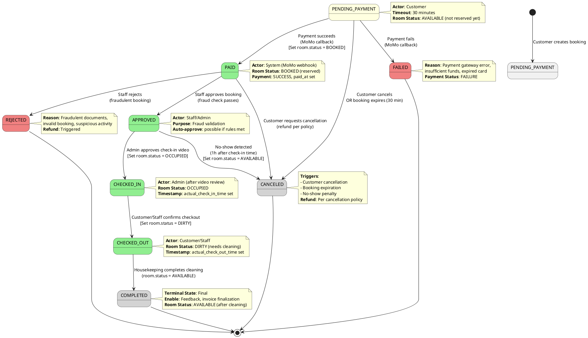
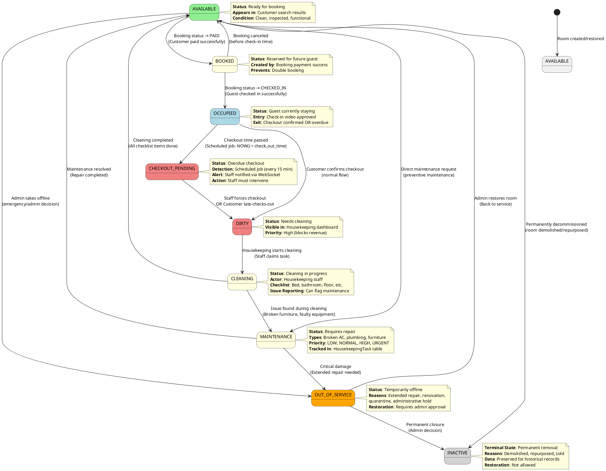
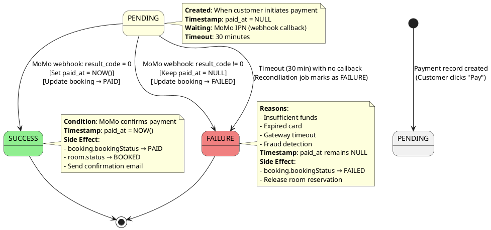
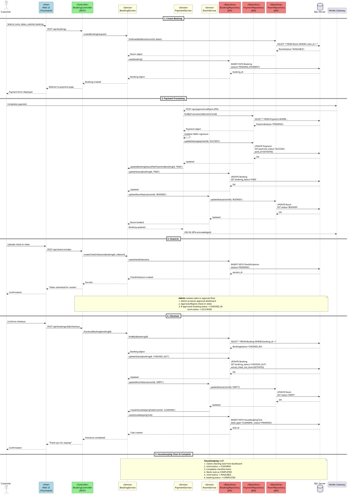

# BookNow — Status Flow Analysis & Standardization Report

> **Prepared by**: Senior Software Architect & QA Engineer
> **Date**: 2026-03-19
> **System**: BookNow — Homestay Booking System (SWP392)
> **Reference Document**: DATABASE_REDESIGN_REPORT.md
> **Purpose**: Analyze, validate, and standardize status flows for Booking, Room, and Payment entities

---

## Executive Summary

This report analyzes the current status flow design in the BookNow system and compares it against industry-standard booking system practices. The analysis identifies **critical gaps**, **incorrect transitions**, **missing edge case handling**, and provides **corrective recommendations** with complete state transition tables and validation against real-world scenarios.

### Key Findings Summary

| Entity | Current Issues | Missing States | Critical Risks |
|--------|---------------|----------------|----------------|
| **Booking** | ❌ No REJECTED/FAILED states<br>❌ WAITING_PAYMENT instead of PENDING_PAYMENT<br>❌ No APPROVED state<br>❌ Missing CHECK constraint | REJECTED, FAILED, APPROVED, PENDING_PAYMENT | Payment failures unhandled; No-shows not tracked; Staff rejection flow missing |
| **Room** | ✅ Well-designed with 8 states<br>⚠️ Missing INACTIVE state | INACTIVE | Limited but operational |
| **Payment** | ⚠️ Incomplete status tracking<br>⚠️ Wrong timestamp defaults | FAILURE not enforced at DB level | Financial reconciliation unreliable |

---

## Table of Contents

1. [Booking Status Analysis](#1-booking-status-analysis)
2. [Room Status Analysis](#2-room-status-analysis)
3. [Payment Status Analysis](#3-payment-status-analysis)
4. [Issues Found in Original Design](#4-issues-found-in-original-design)
5. [Suggested Improvements](#5-suggested-improvements)
6. [Real-World Scenario Validation](#6-real-world-scenario-validation)
7. [State Diagrams (PlantUML)](#7-state-diagrams-plantuml)

---

## 1. Booking Status Analysis

### 1.1 Current Status Design (From DATABASE_REDESIGN_REPORT.md)

**Current States in System:**
```sql
CHECK ([booking_status] IN (
    'PENDING', 'WAITING_PAYMENT', 'PAID',
    'CHECKED_IN', 'CHECKED_OUT', 'COMPLETED', 'CANCELLED'
))
```

**Current Flow (As Documented):**
```
Customer creates booking
    → Status: PENDING
    → Staff approves
    → Status: WAITING_PAYMENT
    → Customer pays via MoMo
    → Status: PAID
    → Customer uploads check-in video
    → Admin reviews and approves
    → Status: CHECKED_IN
    → Customer confirms checkout
    → Status: CHECKED_OUT
    → Status: COMPLETED
```

### 1.2 Required Standardized Flow

**REQUIRED States:**
```
PENDING_PAYMENT → PAID → APPROVED → CHECKED_IN → CHECKED_OUT → COMPLETED

Other possible states:
- FAILED (payment failure)
- CANCELED (customer cancels)
- REJECTED (staff rejects)
```

### 1.3 State Transition Table (CORRECTED)

| Current State | Next State | Condition | Actor | Notes |
|--------------|------------|-----------|-------|-------|
| `PENDING_PAYMENT` | `PAID` | Payment gateway confirms success | System (MoMo callback) | Triggers room status change to BOOKED |
| `PENDING_PAYMENT` | `FAILED` | Payment gateway returns failure | System (MoMo callback) | Release room; notify customer |
| `PENDING_PAYMENT` | `CANCELED` | Customer cancels before payment | Customer | Release room immediately |
| `PAID` | `APPROVED` | Staff validates booking details | Staff/Admin | Optional: auto-approve if rules met |
| `PAID` | `REJECTED` | Staff finds invalid/fraudulent booking | Staff/Admin | Trigger refund process |
| `PAID` | `CANCELED` | Customer cancels after payment | Customer | Check cancellation policy; may trigger partial refund |
| `APPROVED` | `CHECKED_IN` | Admin approves check-in video | Admin | Room status → OCCUPIED |
| `APPROVED` | `CANCELED` | Customer no-show (1h after check-in time) | System (scheduled job) | Apply no-show penalty |
| `CHECKED_IN` | `CHECKED_OUT` | Customer confirms checkout | Customer/System | Room status → DIRTY |
| `CHECKED_IN` | `CHECKED_OUT` | Staff forces checkout (overdue) | Staff | Room status → DIRTY; may charge overtime |
| `CHECKED_OUT` | `COMPLETED` | Room cleaning confirmed | System (after housekeeping) | Final state; enable feedback |

### 1.4 Business Logic Explanation

#### **PENDING_PAYMENT State**
- **When**: Booking record created, but payment not yet initiated
- **Why**: Customer may browse, select room, but not complete payment
- **Actor**: System sets this on booking creation
- **Exit Conditions**:
  - Success → `PAID` (payment succeeds)
  - Failure → `FAILED` (payment fails)
  - Timeout → `CANCELED` (booking expires after 15-30 minutes)

#### **PAID State**
- **When**: Payment gateway confirms successful transaction
- **Why**: Payment captured but booking not yet validated by staff
- **Actor**: System updates via MoMo webhook callback
- **Exit Conditions**:
  - Normal → `APPROVED` (staff validates)
  - Exception → `REJECTED` (fraud detection, invalid booking)

#### **APPROVED State**
- **When**: Staff validates booking is legitimate
- **Why**: Separates payment capture from operational approval
- **Actor**: Staff/Admin manually approves OR system auto-approves based on rules
- **Exit Conditions**:
  - Normal → `CHECKED_IN` (customer arrives and checks in)
  - Exception → `CANCELED` (customer no-show after grace period)

#### **CHECKED_IN State**
- **When**: Admin approves check-in video submission
- **Why**: Guest physically present and occupying room
- **Actor**: Admin after reviewing check-in video
- **Exit Conditions**:
  - Normal → `CHECKED_OUT` (customer confirms checkout OR staff forces checkout)

#### **CHECKED_OUT State**
- **When**: Customer confirms checkout OR staff forces overdue checkout
- **Why**: Guest vacated but room not yet cleaned
- **Actor**: Customer (self-checkout) OR Staff (forced checkout)
- **Exit Conditions**:
  - Normal → `COMPLETED` (after room inspection and cleaning)

#### **COMPLETED State**
- **When**: Entire booking lifecycle finished
- **Why**: Final state enabling feedback, refunds (if any), and closing transaction
- **Actor**: System after housekeeping confirms room cleaned
- **Exit Conditions**: None (terminal state)

#### **FAILED State**
- **When**: Payment transaction fails at gateway
- **Why**: Insufficient funds, expired card, gateway error
- **Actor**: System updates via payment gateway callback
- **Exit Conditions**: None (terminal state) — customer must create new booking

#### **CANCELED State**
- **When**: Booking terminated before completion
- **Why**: Customer cancels OR system cancels (no-show) OR staff cancels (invalid)
- **Actor**: Customer, Staff, or System
- **Triggers**:
  - Pre-payment: Full refund or no charge
  - Post-payment: Refund based on cancellation policy
  - No-show: Penalty charge applied

#### **REJECTED State**
- **When**: Staff determines booking is fraudulent/invalid after payment
- **Why**: Fake ID, suspicious activity, duplicate booking
- **Actor**: Staff/Admin
- **Triggers**: Initiate refund process; block customer if fraud

### 1.5 Issues Found in Original Design

| Issue ID | Severity | Description | Impact |
|----------|----------|-------------|--------|
| **BK-01** | 🔴 CRITICAL | Missing `FAILED` state | Payment failures incorrectly treated as CANCELED; no distinction between payment failure and customer cancellation |
| **BK-02** | 🔴 CRITICAL | Missing `REJECTED` state | No workflow for staff to reject fraudulent/invalid bookings after payment |
| **BK-03** | 🟡 MEDIUM | Uses `WAITING_PAYMENT` instead of `PENDING_PAYMENT` | Naming inconsistency with industry standard; confusing semantics |
| **BK-04** | 🟡 MEDIUM | Missing `APPROVED` state | Direct jump from PAID to CHECKED_IN skips operational validation step |
| **BK-05** | 🔴 CRITICAL | No CHECK constraint on booking_status (AP-06) | Database allows invalid status values; data integrity risk |
| **BK-06** | 🟡 MEDIUM | No handling of no-show scenario | Customers who don't check in lock rooms indefinitely |
| **BK-07** | 🔴 CRITICAL | Missing booking expiration logic | PENDING_PAYMENT bookings never expire; rooms locked forever |
| **BK-08** | 🟡 MEDIUM | Cancellation flow not differentiated | All cancellations treated same; refund policy not enforced by state |

### 1.6 Detected Missing Transitions

| From State | To State | Missing Scenario | Risk |
|------------|----------|------------------|------|
| `PENDING_PAYMENT` | `FAILED` | Payment gateway error | Cannot track payment failure rate |
| `PENDING_PAYMENT` | `EXPIRED` (or CANCELED) | Booking times out | Rooms locked indefinitely |
| `PAID` | `REJECTED` | Staff finds fraud | No workflow to handle fraudulent bookings |
| `APPROVED` | `NO_SHOW` (or CANCELED) | Customer doesn't arrive | Room locked; revenue lost |

---

## 2. Room Status Analysis

### 2.1 Current Status Design (Redesigned in Report)

**OLD Simplified States (Current Production):**
```sql
CHECK (status IN ('AVAILABLE', 'BOOKED', 'MAINTENANCE'))
```

**NEW Redesigned States (In Report):**
```sql
CHECK ([status] IN (
    'AVAILABLE', 'BOOKED', 'OCCUPIED', 'CHECKOUT_PENDING',
    'DIRTY', 'CLEANING', 'MAINTENANCE', 'OUT_OF_SERVICE'
))
```

### 2.2 Required Standardized Flow

**REQUIRED States:**
```
AVAILABLE → BOOKED → OCCUPIED → DIRTY → CLEANING → AVAILABLE

Other states:
- MAINTENANCE
- OUT_OF_SERVICE
- INACTIVE
```

### 2.3 State Transition Table (VALIDATED)

| Current State | Next State | Condition | Actor | Notes |
|--------------|------------|-----------|-------|-------|
| `AVAILABLE` | `BOOKED` | Booking status → PAID | System | Room reserved for future check-in |
| `AVAILABLE` | `OUT_OF_SERVICE` | Admin takes room offline | Admin | Emergency shutdown; no bookings allowed |
| `BOOKED` | `OCCUPIED` | Booking status → CHECKED_IN | System | Guest physically present |
| `BOOKED` | `AVAILABLE` | Booking canceled before check-in | System | Release reservation |
| `OCCUPIED` | `CHECKOUT_PENDING` | NOW() > booking.check_out_time | System (scheduled job) | Overdue checkout detected |
| `OCCUPIED` | `DIRTY` | Customer confirms checkout | Customer/System | Room needs cleaning |
| `CHECKOUT_PENDING` | `DIRTY` | Staff forces checkout | Staff | Late checkout processed |
| `DIRTY` | `CLEANING` | Housekeeping starts task | Housekeeping Staff | Cleaning in progress |
| `CLEANING` | `AVAILABLE` | All checklist items completed | Housekeeping Staff | Room ready for next guest |
| `CLEANING` | `MAINTENANCE` | Issue found during cleaning | Housekeeping Staff | Damage/repair needed |
| `MAINTENANCE` | `AVAILABLE` | Maintenance resolved | Staff/Housekeeping | Repairs completed |
| `MAINTENANCE` | `OUT_OF_SERVICE` | Critical damage requiring extended repair | Admin | Long-term unavailability |
| `OUT_OF_SERVICE` | `AVAILABLE` | Admin restores room | Admin | Back to service |
| `AVAILABLE` | `INACTIVE` | Room permanently removed from inventory | Admin | Renovation/demolition |

### 2.4 Business Logic Explanation

#### **AVAILABLE State**
- **When**: Room is clean, inspected, and ready for booking
- **Why**: Indicates room can be assigned to new bookings
- **Actor**: System sets after housekeeping completes cleaning OR after maintenance resolves issue
- **Business Rules**:
  - Only AVAILABLE rooms appear in customer search results
  - Booking system can assign this room to new reservations
  - Room must pass inspection checklist before becoming AVAILABLE

#### **BOOKED State**
- **When**: Room has active future reservation (booking status = PAID or APPROVED)
- **Why**: Prevents double booking; reserves room for specific customer
- **Actor**: System sets automatically when booking status → PAID
- **Business Rules**:
  - Room removed from availability calendar
  - Cannot be assigned to other bookings for overlapping dates
  - Check-in date stored in booking record

#### **OCCUPIED State**
- **When**: Guest has physically checked in and is currently staying
- **Why**: Tracks physical occupancy separate from reservation
- **Actor**: System sets when booking status → CHECKED_IN
- **Business Rules**:
  - Room cannot be cleaned until customer checks out
  - Housekeeping can only enter with guest permission
  - Overdue checkout detection runs based on this status

#### **CHECKOUT_PENDING State**
- **When**: Scheduled checkout time passed but guest hasn't checked out
- **Why**: Alerts staff to overdue guests; allows proactive intervention
- **Actor**: System scheduled job (runs every 5-15 minutes)
- **Business Rules**:
  - Creates housekeeping task with type OVERDUE_CHECKOUT
  - Staff notified via WebSocket/email
  - Staff must manually resolve (force checkout or extend stay)

#### **DIRTY State**
- **When**: Guest checked out; room needs cleaning
- **Why**: Clear signal to housekeeping staff; room unavailable for booking
- **Actor**: System sets when booking status → CHECKED_OUT
- **Business Rules**:
  - Room removed from available inventory
  - Appears in housekeeping dashboard as priority task
  - Housekeeping must claim task to transition to CLEANING

#### **CLEANING State**
- **When**: Housekeeping staff actively cleaning room
- **Why**: Tracks work-in-progress; prevents reassignment
- **Actor**: Housekeeping staff starts cleaning task
- **Business Rules**:
  - Checklist items must be completed
  - Staff can report maintenance issues during cleaning
  - Only assigned housekeeping staff can complete task

#### **MAINTENANCE State**
- **When**: Room requires repair/maintenance work
- **Why**: Prevents booking damaged rooms; tracks repair workflow
- **Actor**: Housekeeping staff reports issue OR Admin sets manually
- **Triggers**:
  - Broken furniture, faulty electrical, plumbing issues
  - Damage discovered during cleaning
  - Preventive maintenance scheduled
- **Business Rules**:
  - HousekeepingTask created with type MAINTENANCE
  - Priority level set (LOW, NORMAL, HIGH, URGENT)
  - Staff documents issue in notes field

#### **OUT_OF_SERVICE State**
- **When**: Room temporarily removed from inventory (Admin decision)
- **Why**: Extended repairs, renovation, quarantine, administrative hold
- **Actor**: Admin manually sets
- **Business Rules**:
  - Completely removed from booking system
  - No housekeeping tasks generated
  - Requires admin approval to restore

#### **INACTIVE State** ⚠️ **MISSING IN CURRENT DESIGN**
- **When**: Room permanently removed from operational inventory
- **Why**: Room demolished, repurposed, sold, or permanently closed
- **Actor**: Admin
- **Business Rules**:
  - Soft delete alternative; preserves historical data
  - Never appears in any operational query
  - Cannot be restored to active service

### 2.5 Issues Found in Original Design

| Issue ID | Severity | Description | Impact |
|----------|----------|-------------|--------|
| **RM-01** | 🔴 CRITICAL | Old schema only has 3 states (AVAILABLE, BOOKED, MAINTENANCE) | Cannot track room lifecycle; dirty rooms may be shown as available |
| **RM-02** | 🟢 RESOLVED | Redesign adds comprehensive 8-state model | ✅ Well-designed solution |
| **RM-03** | 🟡 MEDIUM | Missing `INACTIVE` state | Cannot handle permanent room decommissioning |
| **RM-04** | 🟡 MEDIUM | No audit trail (FIXED by RoomStatusLog table) | ✅ Added in redesign |
| **RM-05** | 🔴 CRITICAL | Checkout directly sets room to AVAILABLE | Dirty rooms assigned to new guests (FIXED in redesign) |
| **RM-06** | 🟡 MEDIUM | No overdue checkout detection | Guests can overstay indefinitely (FIXED by CHECKOUT_PENDING) |

**✅ Overall Assessment**: The redesigned room status flow is **well-architected** and follows industry best practices. Only minor addition (INACTIVE state) recommended.

---

## 3. Payment Status Analysis

### 3.1 Current Status Design

**Current States (Inferred from Code/Docs):**
- `PENDING` (payment record created before customer pays)
- `SUCCESS` (payment confirmed by MoMo)
- `FAILURE` (payment failed — not explicitly shown in schema)

**No CHECK Constraint Found** — Status validation only in application layer.

### 3.2 Required Standardized Flow

**REQUIRED States:**
```
- SUCCESS (payment confirmed)
- FAILURE (payment failed)
```

### 3.3 State Transition Table

| Current State | Next State | Condition | Actor | Notes |
|--------------|------------|-----------|-------|-------|
| `PENDING` | `SUCCESS` | MoMo webhook confirms payment | System (MoMo callback) | Set paid_at timestamp; update booking status to PAID |
| `PENDING` | `FAILURE` | MoMo webhook reports failure | System (MoMo callback) | DO NOT set paid_at; update booking status to FAILED |

### 3.4 Business Logic Explanation

#### **PENDING State**
- **When**: Payment record created; awaiting MoMo transaction result
- **Why**: Async payment flow; customer redirected to MoMo; result comes via webhook
- **Actor**: System creates payment record when customer initiates payment
- **Business Rules**:
  - `paid_at` must be **NULL** (issue AP-05 in original design)
  - Payment record linked to booking_id
  - Timeout after 15-30 minutes if no callback received

#### **SUCCESS State**
- **When**: MoMo webhook confirms successful payment
- **Why**: Final confirmation of funds capture
- **Actor**: System updates via MoMo IPN (Instant Payment Notification)
- **Business Rules**:
  - Set `paid_at = sysdatetime()` **ONLY NOW** (not at record creation)
  - Update booking status to PAID
  - Trigger room status update to BOOKED
  - Send confirmation email to customer

#### **FAILURE State**
- **When**: MoMo webhook reports payment failure
- **Why**: Insufficient funds, expired card, gateway error, fraud detection
- **Actor**: System updates via MoMo callback
- **Business Rules**:
  - Keep `paid_at = NULL`
  - Update booking status to FAILED
  - Release room reservation
  - Notify customer with failure reason

### 3.5 Issues Found in Original Design

| Issue ID | Severity | Description | Impact |
|----------|----------|-------------|--------|
| **PM-01** | 🔴 CRITICAL | `paid_at` defaults to sysdatetime() at creation (AP-05) | Incorrect timestamps; financial reconciliation unreliable |
| **PM-02** | 🟡 MEDIUM | No CHECK constraint on payment_status | Can insert invalid status values |
| **PM-03** | 🟡 MEDIUM | FAILURE status not explicitly in schema | May use inconsistent strings like "FAILED", "FAID" (typo), "ERROR" |
| **PM-04** | 🟡 MEDIUM | No timeout handling for PENDING payments | Stale payment records accumulate |

### 3.6 Suggested Corrections

**Add CHECK Constraint:**
```sql
ALTER TABLE [dbo].[Payment] ADD CONSTRAINT [CK_Payment_Status]
CHECK ([payment_status] IN ('PENDING', 'SUCCESS', 'FAILURE'));
```

**Fix paid_at Timestamp Logic:**
```sql
-- Already addressed in redesign report (line 919-923):
ALTER TABLE [dbo].[Payment] DROP CONSTRAINT [DF_Payment_PaidAt];
ALTER TABLE [dbo].[Payment] ALTER COLUMN [paid_at] [datetime2](7) NULL;
```

**Update Payment Handler Logic:**
```java
// When payment succeeds
payment.setPaymentStatus("SUCCESS");
payment.setPaidAt(LocalDateTime.now());
booking.setBookingStatus("PAID");

// When payment fails
payment.setPaymentStatus("FAILURE");
payment.setPaidAt(null); // Keep null
booking.setBookingStatus("FAILED");
```

---

## 4. Issues Found in Original Design

### 4.1 Summary Table

| Category | Issue | Severity | Status in Redesign |
|----------|-------|----------|-------------------|
| **Booking Status** | Missing FAILED state | 🔴 CRITICAL | ❌ Not addressed |
| **Booking Status** | Missing REJECTED state | 🔴 CRITICAL | ❌ Not addressed |
| **Booking Status** | Missing APPROVED state | 🟡 MEDIUM | ❌ Not addressed |
| **Booking Status** | Using WAITING_PAYMENT instead of PENDING_PAYMENT | 🟡 MEDIUM | ❌ Not addressed |
| **Booking Status** | No CHECK constraint | 🔴 CRITICAL | ✅ Fixed (line 900-904) |
| **Booking Status** | No booking expiration logic | 🔴 CRITICAL | ❌ Not addressed |
| **Booking Status** | No no-show handling | 🟡 MEDIUM | ❌ Not addressed |
| **Room Status** | Only 3 states in old schema | 🔴 CRITICAL | ✅ Fixed (8 states added) |
| **Room Status** | Missing INACTIVE state | 🟡 MEDIUM | ❌ Not addressed |
| **Room Status** | No audit trail | 🔴 CRITICAL | ✅ Fixed (RoomStatusLog added) |
| **Room Status** | Checkout → AVAILABLE directly | 🔴 CRITICAL | ✅ Fixed (DIRTY + CLEANING added) |
| **Payment Status** | paid_at timestamp defaults at creation | 🔴 CRITICAL | ✅ Fixed (line 919-923) |
| **Payment Status** | No CHECK constraint | 🟡 MEDIUM | ❌ Not addressed |
| **Payment Status** | FAILURE state not enforced | 🟡 MEDIUM | ❌ Not addressed |

### 4.2 Wrong/Incorrect Flows

#### **Flow Error #1: Checkout bypasses cleaning (OLD DESIGN)**
```
INCORRECT (OLD):
OCCUPIED → (checkout) → AVAILABLE ❌

CORRECT (NEW):
OCCUPIED → DIRTY → CLEANING → AVAILABLE ✅
```

#### **Flow Error #2: Payment failure not handled**
```
INCORRECT (CURRENT):
PENDING_PAYMENT → (payment fails) → ??? (no defined state)

CORRECT (REQUIRED):
PENDING_PAYMENT → (payment fails) → FAILED ✅
```

#### **Flow Error #3: No staff approval flow**
```
INCORRECT (CURRENT):
PAID → (check-in video) → CHECKED_IN

CORRECT (REQUIRED):
PAID → APPROVED → (check-in video) → CHECKED_IN ✅
```

### 4.3 Missing Edge Cases

| Scenario | Current Handling | Required Handling |
|----------|-----------------|-------------------|
| **Customer abandons payment** | PENDING_PAYMENT stays forever | Expire after 30 mins → CANCELED |
| **Payment gateway timeout** | No status update | System retry → FAILED after 3 attempts |
| **Staff finds fraudulent booking** | Must manually cancel | PAID → REJECTED (triggers refund) |
| **Customer no-show** | Room stays BOOKED | APPROVED → CANCELED (after 1h grace period) |
| **Customer overstays checkout** | Manual staff intervention | System auto-detects → CHECKOUT_PENDING |
| **Room damaged during stay** | Not tracked | CLEANING → MAINTENANCE (with notes) |
| **Room permanently closed** | Must use MAINTENANCE or OUT_OF_SERVICE | Should use INACTIVE state |

---

## 5. Suggested Improvements

### 5.1 Booking Status Improvements

#### **A. Add Missing States**
```sql
ALTER TABLE [dbo].[Booking] DROP CONSTRAINT [CK_Booking_Status];
GO

ALTER TABLE [dbo].[Booking] ADD CONSTRAINT [CK_Booking_Status]
CHECK ([booking_status] IN (
    'PENDING_PAYMENT',  -- Renamed from WAITING_PAYMENT
    'PAID',
    'APPROVED',         -- NEW: Staff validation step
    'CHECKED_IN',
    'CHECKED_OUT',
    'COMPLETED',
    'FAILED',           -- NEW: Payment failure
    'REJECTED',         -- NEW: Staff rejection
    'CANCELED'          -- Corrected spelling (was CANCELLED)
));
GO
```

#### **B. Implement Booking Expiration**
```java
@Scheduled(cron = "0 */5 * * * *") // Every 5 minutes
public void expirePendingBookings() {
    LocalDateTime expirationTime = LocalDateTime.now().minusMinutes(30);

    List<Booking> expiredBookings = bookingRepository.findAll()
        .stream()
        .filter(b -> "PENDING_PAYMENT".equals(b.getBookingStatus()))
        .filter(b -> b.getCreatedAt().isBefore(expirationTime))
        .collect(Collectors.toList());

    expiredBookings.forEach(booking -> {
        booking.setBookingStatus("CANCELED");
        // Release room if reserved
        bookingRepository.save(booking);
    });
}
```

#### **C. Implement No-Show Detection**
```java
@Scheduled(cron = "0 */15 * * * *") // Every 15 minutes
public void detectNoShows() {
    LocalDateTime graceDeadline = LocalDateTime.now().minusHours(1);

    List<Booking> noShows = bookingRepository.findAll()
        .stream()
        .filter(b -> "APPROVED".equals(b.getBookingStatus()))
        .filter(b -> b.getCheckInTime().isBefore(graceDeadline))
        .collect(Collectors.toList());

    noShows.forEach(booking -> {
        booking.setBookingStatus("CANCELED");
        bookingRepository.save(booking);

        // Update room status back to AVAILABLE
        Room room = booking.getRoom();
        room.setStatus("AVAILABLE");
        roomRepository.save(room);

        // Apply no-show penalty (keep payment or partial refund)
        // ... penalty logic ...
    });
}
```

#### **D. Add State Transition Validation**
```java
public class BookingStatusValidator {
    private static final Map<String, List<String>> ALLOWED_TRANSITIONS = Map.of(
        "PENDING_PAYMENT", List.of("PAID", "FAILED", "CANCELED"),
        "PAID", List.of("APPROVED", "REJECTED", "CANCELED"),
        "APPROVED", List.of("CHECKED_IN", "CANCELED"),
        "CHECKED_IN", List.of("CHECKED_OUT"),
        "CHECKED_OUT", List.of("COMPLETED"),
        "FAILED", List.of(),      // Terminal state
        "REJECTED", List.of(),    // Terminal state
        "CANCELED", List.of(),    // Terminal state
        "COMPLETED", List.of()    // Terminal state
    );

    public static boolean isValidTransition(String fromStatus, String toStatus) {
        return ALLOWED_TRANSITIONS.getOrDefault(fromStatus, List.of())
                                   .contains(toStatus);
    }

    public static void validateTransition(String fromStatus, String toStatus) {
        if (!isValidTransition(fromStatus, toStatus)) {
            throw new IllegalStateTransitionException(
                String.format("Invalid booking status transition: %s → %s",
                              fromStatus, toStatus)
            );
        }
    }
}
```

### 5.2 Room Status Improvements

#### **A. Add INACTIVE State**
```sql
ALTER TABLE [dbo].[Room] DROP CONSTRAINT [CK_Room_Status];
GO

ALTER TABLE [dbo].[Room] ADD CONSTRAINT [CK_Room_Status]
CHECK ([status] IN (
    'AVAILABLE', 'BOOKED', 'OCCUPIED', 'CHECKOUT_PENDING',
    'DIRTY', 'CLEANING', 'MAINTENANCE', 'OUT_OF_SERVICE',
    'INACTIVE'  -- NEW
));
GO
```

#### **B. Add Room Status Transition Validator**
```java
public class RoomStatusValidator {
    private static final Map<String, List<String>> ALLOWED_TRANSITIONS = Map.of(
        "AVAILABLE", List.of("BOOKED", "OUT_OF_SERVICE", "MAINTENANCE", "INACTIVE"),
        "BOOKED", List.of("OCCUPIED", "AVAILABLE"), // AVAILABLE if booking canceled
        "OCCUPIED", List.of("DIRTY", "CHECKOUT_PENDING"),
        "CHECKOUT_PENDING", List.of("DIRTY"),
        "DIRTY", List.of("CLEANING"),
        "CLEANING", List.of("AVAILABLE", "MAINTENANCE"),
        "MAINTENANCE", List.of("AVAILABLE", "OUT_OF_SERVICE"),
        "OUT_OF_SERVICE", List.of("AVAILABLE", "INACTIVE"),
        "INACTIVE", List.of() // Terminal state
    );

    public static void validateTransition(String fromStatus, String toStatus) {
        if (!ALLOWED_TRANSITIONS.getOrDefault(fromStatus, List.of()).contains(toStatus)) {
            throw new IllegalStateTransitionException(
                String.format("Invalid room status transition: %s → %s",
                              fromStatus, toStatus)
            );
        }
    }
}
```

### 5.3 Payment Status Improvements

#### **A. Add CHECK Constraint**
```sql
ALTER TABLE [dbo].[Payment] ADD CONSTRAINT [CK_Payment_Status]
CHECK ([payment_status] IN ('PENDING', 'SUCCESS', 'FAILURE'));
GO
```

#### **B. Add Payment Timeout Handler**
```java
@Scheduled(cron = "0 */10 * * * *") // Every 10 minutes
public void timeoutStalePendingPayments() {
    LocalDateTime timeoutThreshold = LocalDateTime.now().minusMinutes(30);

    List<Payment> stalePayments = paymentRepository.findAll()
        .stream()
        .filter(p -> "PENDING".equals(p.getPaymentStatus()))
        .filter(p -> p.getCreatedAt().isBefore(timeoutThreshold))
        .collect(Collectors.toList());

    stalePayments.forEach(payment -> {
        payment.setPaymentStatus("FAILURE");
        paymentRepository.save(payment);

        // Update related booking
        Booking booking = payment.getBooking();
        booking.setBookingStatus("FAILED");
        bookingRepository.save(booking);
    });
}
```

### 5.4 Optimize Database Constraints

#### **Add Conditional Constraints**
```sql
-- Ensure paid_at is set ONLY when payment_status = SUCCESS
ALTER TABLE [dbo].[Payment] ADD CONSTRAINT [CK_Payment_PaidAt_Success]
CHECK (
    (payment_status = 'SUCCESS' AND paid_at IS NOT NULL) OR
    (payment_status != 'SUCCESS' AND paid_at IS NULL)
);
GO

-- Ensure actual_check_in_time is set ONLY when booking_status >= CHECKED_IN
ALTER TABLE [dbo].[Booking] ADD CONSTRAINT [CK_Booking_ActualCheckIn]
CHECK (
    (booking_status IN ('CHECKED_IN', 'CHECKED_OUT', 'COMPLETED') AND actual_check_in_time IS NOT NULL) OR
    (booking_status NOT IN ('CHECKED_IN', 'CHECKED_OUT', 'COMPLETED') AND actual_check_in_time IS NULL)
);
GO

-- Ensure actual_check_out_time is set ONLY when booking_status >= CHECKED_OUT
ALTER TABLE [dbo].[Booking] ADD CONSTRAINT [CK_Booking_ActualCheckOut]
CHECK (
    (booking_status IN ('CHECKED_OUT', 'COMPLETED') AND actual_check_out_time IS NOT NULL) OR
    (booking_status NOT IN ('CHECKED_OUT', 'COMPLETED') AND actual_check_out_time IS NULL)
);
GO
```

### 5.5 Prevent Double Booking Bug

#### **Add Overlapping Booking Check Constraint**
```sql
-- Create function to check overlapping bookings
CREATE FUNCTION dbo.fn_CheckOverlappingBookings(
    @room_id BIGINT,
    @check_in_time DATETIME2,
    @check_out_time DATETIME2,
    @booking_id BIGINT
)
RETURNS BIT
AS
BEGIN
    DECLARE @hasOverlap BIT = 0;

    IF EXISTS (
        SELECT 1
        FROM Booking
        WHERE room_id = @room_id
          AND booking_id != @booking_id
          AND booking_status IN ('PAID', 'APPROVED', 'CHECKED_IN')
          AND (
              (check_in_time < @check_out_time AND check_out_time > @check_in_time)
          )
    )
    BEGIN
        SET @hasOverlap = 1;
    END

    RETURN @hasOverlap;
END;
GO

-- Add constraint (optional; may impact performance; consider trigger instead)
-- Enforced in application layer for better control
```

#### **Application-Layer Validation (Recommended)**
```java
@Transactional(isolation = Isolation.SERIALIZABLE)
public Booking createBooking(BookingRequest request) {
    // Pessimistic locking to prevent race conditions
    Room room = roomRepository.findByIdWithLock(request.getRoomId());

    // Check if room is available for the date range
    boolean hasOverlap = bookingRepository.existsOverlappingBooking(
        request.getRoomId(),
        request.getCheckInTime(),
        request.getCheckOutTime(),
        List.of("PAID", "APPROVED", "CHECKED_IN")
    );

    if (hasOverlap) {
        throw new RoomNotAvailableException("Room already booked for selected dates");
    }

    // Create booking
    Booking booking = new Booking();
    // ... set fields ...
    booking.setBookingStatus("PENDING_PAYMENT");

    return bookingRepository.save(booking);
}
```

---

## 6. Real-World Scenario Validation

### 6.1 Scenario 1: Customer Cancels Before Payment

**Given:**
- Customer selects room and creates booking
- Booking status = `PENDING_PAYMENT`
- Customer decides not to proceed

**Expected Flow:**
```
1. Customer clicks "Cancel Booking" button
2. System validates: status is PENDING_PAYMENT
3. System updates: booking.bookingStatus = "CANCELED"
4. System logs: "Customer canceled before payment"
5. No payment record exists (not created yet)
6. Room remains AVAILABLE
```

**Current Design Handling:** ✅ **WORKS** — CANCELED state exists
**Issue:** No automatic expiration if customer closes browser (Fixed by expiration job in 5.1.B)

---

### 6.2 Scenario 2: Payment Fails

**Given:**
- Customer initiates payment
- Payment record created: status = `PENDING`
- MoMo gateway returns error (insufficient funds)

**Expected Flow:**
```
1. MoMo sends webhook with result_code != 0
2. System updates: payment.paymentStatus = "FAILURE"
3. System keeps: payment.paidAt = NULL
4. System updates: booking.bookingStatus = "FAILED"
5. System releases room: no room status change needed (was still AVAILABLE)
6. System notifies customer: "Payment failed. Reason: Insufficient funds."
7. Customer can retry with new booking
```

**Current Design Handling:** ❌ **BROKEN** — No `FAILED` state in booking status
**Fix Required:** Add `FAILED` state (Section 5.1.A)

---

### 6.3 Scenario 3: Customer No-Show (Doesn't Check In)

**Given:**
- Booking status = `APPROVED`
- Room status = `BOOKED`
- Check-in time: 2:00 PM
- Current time: 3:30 PM (1.5 hours past check-in)
- Customer never uploaded check-in video

**Expected Flow:**
```
1. Scheduled job runs every 15 minutes
2. Job detects: NOW() > check_in_time + 1 hour grace period
3. System updates: booking.bookingStatus = "CANCELED"
4. System updates: room.status = "AVAILABLE"
5. System creates: RoomStatusLog entry
6. System applies: no-show penalty (keep payment or charge fee)
7. System notifies staff: "Booking #1234 marked as no-show"
8. Room becomes available for new bookings
```

**Current Design Handling:** ❌ **BROKEN** — No no-show detection logic
**Fix Required:** Implement no-show detector (Section 5.1.C)

---

### 6.4 Scenario 4: Staff Rejects Booking (Fraud Detection)

**Given:**
- Booking status = `PAID`
- Payment successful and captured
- Staff reviews booking details and finds:
  - Fake ID card images
  - Credit card holder name doesn't match ID
  - Suspicious pattern (10 bookings same day from same IP)

**Expected Flow:**
```
1. Staff clicks "Reject Booking" in admin panel
2. System validates: booking status is PAID
3. System updates: booking.bookingStatus = "REJECTED"
4. System triggers: refund process (MoMo refund API)
5. System updates: payment.refundedAt = NOW()
6. System logs: "Booking rejected by staff. Reason: Fraudulent documents."
7. System flags: customer account for review
8. System releases: room back to AVAILABLE
9. System notifies customer: "Booking rejected due to verification failure."
```

**Current Design Handling:** ❌ **BROKEN** — No `REJECTED` state exists
**Fix Required:** Add `REJECTED` state (Section 5.1.A)

---

### 6.5 Scenario 5: Room Under Maintenance (Broken AC)

**Given:**
- Room status = `CLEANING`
- Housekeeping staff finds broken air conditioner
- Summer season; AC is critical amenity

**Expected Flow:**
```
1. Housekeeping staff completes cleaning checklist
2. Staff clicks "Report Maintenance Issue" in cleaning form
3. System shows form: Issue description, Priority level
4. Staff enters: "Air conditioner not cooling. Compressor failure."
5. Staff sets priority: HIGH
6. System updates: room.status = "MAINTENANCE"
7. System creates: HousekeepingTask
   - task_type = "MAINTENANCE"
   - task_status = "PENDING"
   - priority = "HIGH"
   - notes = "AC compressor failure"
8. System creates: RoomStatusLog entry
   - previous_status = "CLEANING"
   - new_status = "MAINTENANCE"
   - changed_by = housekeeping_staff_id
9. System removes: room from booking availability
10. Maintenance staff receives notification
11. Maintenance staff completes repair
12. Staff updates: task_status = "COMPLETED"
13. System updates: room.status = "AVAILABLE"
14. Room returns to booking inventory
```

**Current Design Handling:** ✅ **WORKS** — Redesign handles this correctly
**Transition:** `CLEANING → MAINTENANCE → AVAILABLE` (Table T8, T9)

---

### 6.6 Scenario 6: Customer Overstays Checkout Time

**Given:**
- Booking status = `CHECKED_IN`
- Room status = `OCCUPIED`
- Scheduled checkout: 12:00 PM
- Current time: 1:15 PM
- Customer has not confirmed checkout

**Expected Flow:**
```
1. Scheduled job runs every 15 minutes (1:15 PM execution)
2. Job query finds: booking.check_out_time < NOW() AND booking_status = 'CHECKED_IN'
3. System updates: room.status = "CHECKOUT_PENDING"
4. System creates: HousekeepingTask
   - task_type = "OVERDUE_CHECKOUT"
   - task_status = "PENDING"
   - priority = "HIGH"
5. System creates: RoomStatusLog entry
6. System sends: WebSocket notification to staff dashboard
7. Staff contacts customer: "Please confirm checkout"
8. Scenario A (Customer checks out):
   - Customer confirms checkout via app
   - System updates: booking.bookingStatus = "CHECKED_OUT"
   - System updates: room.status = "DIRTY"
   - System may charge: overtime fee (1 hour late)
9. Scenario B (Customer refuses to check out):
   - Staff performs forced checkout
   - System updates: booking.bookingStatus = "CHECKED_OUT"
   - System updates: room.status = "DIRTY"
   - System charges: full overtime fee + penalty
```

**Current Design Handling:** ✅ **WORKS** — Redesign handles this correctly
**Status:** `OCCUPIED → CHECKOUT_PENDING → DIRTY` (Table T4, T5)

---

### 6.7 Scenario 7: Payment Gateway Timeout (No Callback Received)

**Given:**
- Customer clicks "Pay" button
- Redirected to MoMo payment page
- Payment record created: status = `PENDING`
- Customer completes payment on MoMo
- MoMo webhook fails to notify system (network error)

**Expected Flow:**
```
1. Payment created at 2:00 PM
2. Customer pays at 2:02 PM (system doesn't know yet)
3. MoMo webhook delivery fails (timeout/network issue)
4. MoMo retries webhook (typically 3-5 retries over 10 minutes)
5. Scenario A (Webhook succeeds on retry):
   - System receives callback at 2:12 PM
   - System updates payment status to SUCCESS
   - Normal flow continues
6. Scenario B (All retries fail):
   - Timeout job runs at 2:30 PM (30 mins after creation)
   - Job finds payment still PENDING after 30 minutes
   - System calls: MoMo "Query Payment Status" API
   - MoMo API returns: payment is successful
   - System reconciles: payment.paymentStatus = "SUCCESS"
   - System updates: payment.paidAt = actual_payment_time (from MoMo)
   - Normal flow continues
7. Scenario C (Payment actually failed):
   - Query API returns: payment failed
   - System updates: payment.paymentStatus = "FAILURE"
   - System updates: booking.bookingStatus = "FAILED"
```

**Current Design Handling:** ⚠️ **PARTIAL** — No timeout handler or reconciliation logic
**Fix Required:** Add payment timeout handler (Section 5.3.B) + manual reconciliation cron job

---

### 6.8 Scenario 8: Concurrent Booking Attempt (Race Condition)

**Given:**
- Room 101 is AVAILABLE
- Customer A and Customer B both viewing Room 101
- Both click "Book Now" at the same time (within 100ms)
- Only 1 booking should succeed

**Expected Flow:**
```
1. Request A arrives: Thread A acquires pessimistic lock on Room 101
2. Request B arrives: Thread B waits for lock
3. Thread A checks: room is AVAILABLE, no overlapping bookings
4. Thread A creates: Booking A with status = PENDING_PAYMENT
5. Thread A commits transaction and releases lock
6. Thread B acquires lock
7. Thread B checks: Booking A exists with PENDING_PAYMENT
8. Thread B validation: overlapping date range found
9. Thread B rejects: throws RoomNotAvailableException
10. Customer B sees: "Room no longer available. Please select another room."
11. Customer A proceeds: to payment page
```

**Current Design Handling:** ⚠️ **UNKNOWN** — Not documented; likely prone to race conditions
**Fix Required:** Implement SERIALIZABLE transaction + pessimistic locking (Section 5.5)

---

## 7. State Diagrams (PlantUML)

### 7.1 Booking Status State Diagram (CORRECTED)



---

### 7.2 Room Status State Diagram (VALIDATED)



---

### 7.3 Payment Status State Diagram (SIMPLE)



---

### 7.4 Complete System Flow — Booking Lifecycle with Layered Architecture



---

## Conclusion

### Summary of Recommendations

| Priority | Recommendation | Impact | Effort |
|----------|---------------|--------|--------|
| 🔴 **P0** | Add FAILED, REJECTED booking states | High | Low |
| 🔴 **P0** | Add CHECK constraint on booking_status | High | Low |
| 🔴 **P0** | Fix Payment.paid_at timestamp logic | High | Medium |
| 🟡 **P1** | Implement booking expiration (30 min) | Medium | Medium |
| 🟡 **P1** | Implement no-show detection (1h grace) | Medium | Medium |
| 🟡 **P1** | Add INACTIVE room state | Low | Low |
| 🟡 **P1** | Add CHECK constraint on payment_status | Medium | Low |
| 🟢 **P2** | Implement payment timeout reconciliation | Medium | High |
| 🟢 **P2** | Add state transition validators | Low | Medium |
| 🟢 **P2** | Add conditional CHECK constraints | Low | Medium |

### Final Assessment

**Booking Status**: ❌ **Needs Correction** — Missing critical states (FAILED, REJECTED, APPROVED)
**Room Status**: ✅ **Well-Designed** — Comprehensive 8-state lifecycle model
**Payment Status**: ⚠️ **Needs Improvement** — Timestamp logic broken; missing CHECK constraint

**Overall System Health**: ⚠️ **70% Complete** — Strong foundation with critical gaps in edge case handling and state validation.

---

**End of Report**
