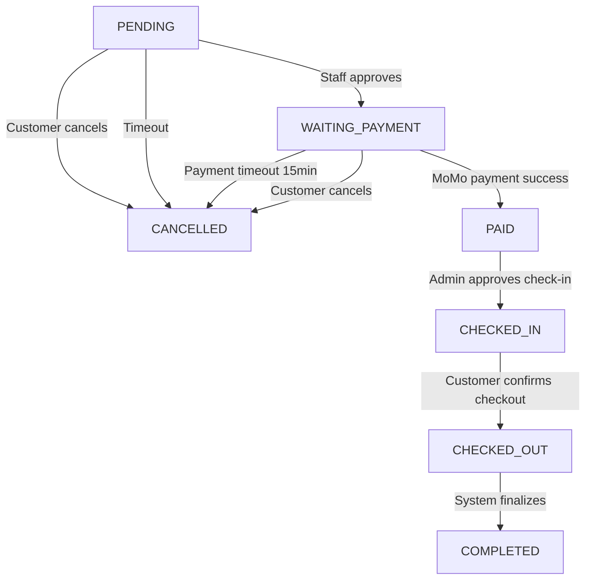
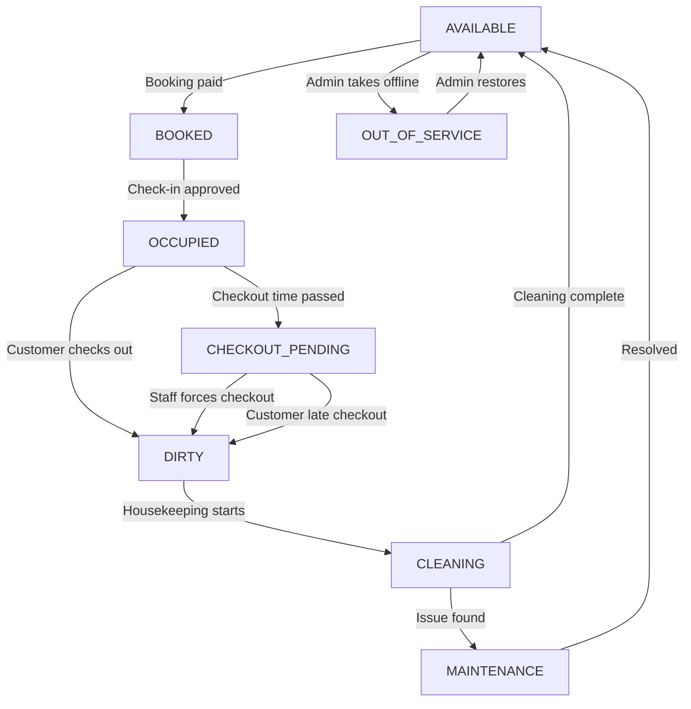
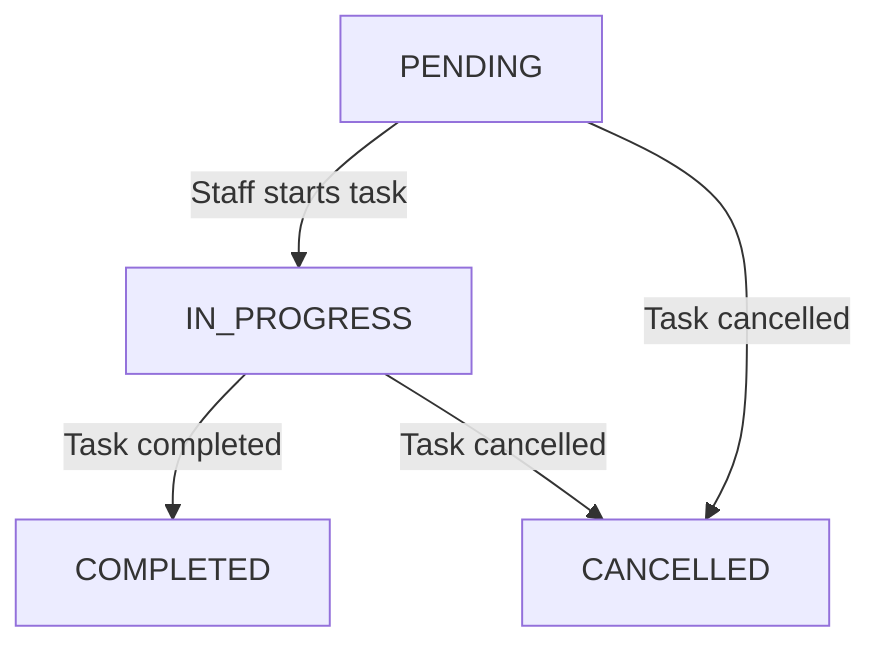
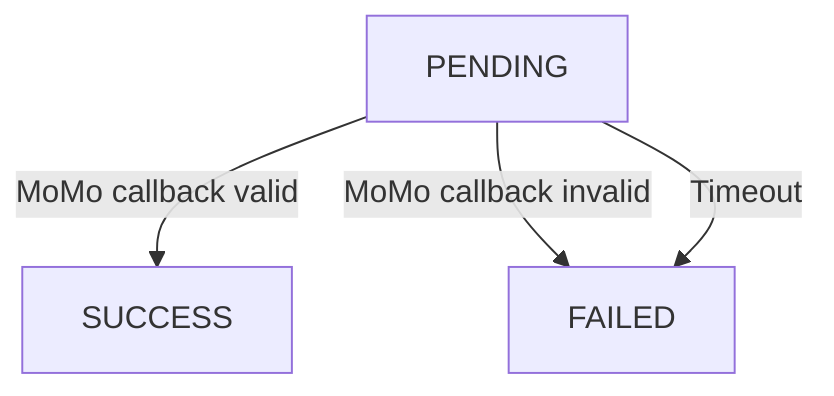
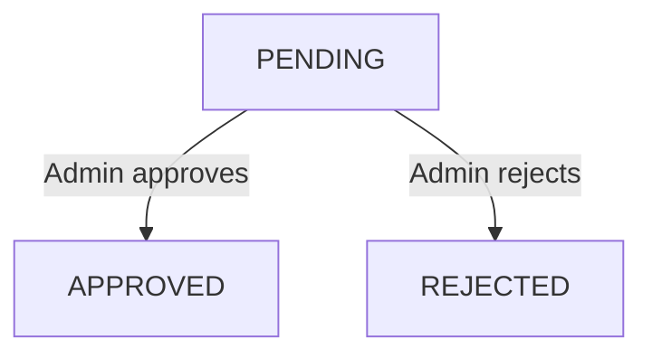
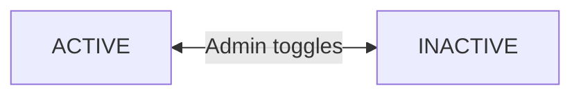

# System Status Lifecycle

## 1. Booking Status

The booking status is the central lifecycle in the system, governing the entire customer journey from reservation to departure.

### States

| Status | Description |
|--------|-------------|
| `PENDING` | Booking created by customer, awaiting staff approval |
| `WAITING_PAYMENT` | Staff approved; customer must pay within 15 minutes |
| `PAID` | Payment successfully completed via MoMo |
| `CHECKED_IN` | Customer physically checked in (video verified by admin) |
| `CHECKED_OUT` | Customer checked out; room released to cleaning |
| `COMPLETED` | Booking fully completed (used for revenue reporting) |
| `CANCELLED` | Booking cancelled by customer, staff, or system timeout |

### Transition Diagram



### Transition Rules

| From | To | Trigger | Actor |
|------|----|---------|-------|
| `PENDING` | `WAITING_PAYMENT` | Staff approves booking | Staff/Admin |
| `PENDING` | `CANCELLED` | Customer cancels or approval timeout | Customer/System |
| `WAITING_PAYMENT` | `PAID` | MoMo callback with valid signature | System (MoMo callback) |
| `WAITING_PAYMENT` | `CANCELLED` | Payment window expires (15 min) | System |
| `PAID` | `CHECKED_IN` | Admin approves check-in video | Admin |
| `CHECKED_IN` | `CHECKED_OUT` | Customer confirms checkout | Customer |
| `CHECKED_OUT` | `COMPLETED` | System finalizes | System |

### Side Effects

| Transition | Side Effect |
|-----------|------------|
| → `PAID` | Payment record updated to `SUCCESS`; `paid_at` set; Room status → `BOOKED` |
| → `CHECKED_IN` | `actual_check_in_time` set; Room status → `OCCUPIED` |
| → `CHECKED_OUT` | `actual_check_out_time` set; Room status → `DIRTY`; HousekeepingTask created |
| → `CANCELLED` | Room released (if applicable); no further transitions allowed |

---

## 2. Room Status

Room status tracks the physical and operational state of each room.

### States

| Status | Description | Bookable |
|--------|-------------|----------|
| `AVAILABLE` | Room is clean, inspected, and ready for booking | Yes |
| `BOOKED` | Room is reserved by an active booking (guest not arrived) | No |
| `OCCUPIED` | Guest has physically checked in and is staying | No |
| `CHECKOUT_PENDING` | Check-out time has passed but guest has not checked out | No |
| `DIRTY` | Guest checked out; room needs cleaning | No |
| `CLEANING` | Housekeeping staff is actively cleaning the room | No |
| `MAINTENANCE` | Room requires repair / maintenance work | No |
| `OUT_OF_SERVICE` | Room is temporarily removed from inventory by admin | No |

### Transition Diagram



### Transition Rules

| # | From | To | Trigger | Actor |
|---|------|----|---------|-------|
| T1 | `AVAILABLE` | `BOOKED` | Booking reaches PAID status | System |
| T2 | `BOOKED` | `OCCUPIED` | Admin approves check-in | Admin |
| T3 | `OCCUPIED` | `DIRTY` | Customer confirms checkout | Customer / System |
| T4 | `OCCUPIED` | `CHECKOUT_PENDING` | Scheduled job: `NOW() > check_out_time` | System (cron) |
| T5 | `CHECKOUT_PENDING` | `DIRTY` | Staff forces checkout OR customer late-checks-out | Staff / Customer |
| T6 | `DIRTY` | `CLEANING` | Housekeeping starts cleaning task | Housekeeping |
| T7 | `CLEANING` | `AVAILABLE` | Housekeeping completes all checklist items | Housekeeping |
| T8 | `CLEANING` | `MAINTENANCE` | Housekeeping reports issue during cleaning | Housekeeping |
| T9 | `MAINTENANCE` | `AVAILABLE` | Maintenance resolved by staff/housekeeping | Staff / Housekeeping |
| T10 | Any | `OUT_OF_SERVICE` | Admin takes room offline | Admin |
| T11 | `OUT_OF_SERVICE` | `AVAILABLE` | Admin restores room | Admin |

### Database Constraint

```sql
CHECK (status IN (
    'AVAILABLE', 'BOOKED', 'OCCUPIED', 'CHECKOUT_PENDING',
    'DIRTY', 'CLEANING', 'MAINTENANCE', 'OUT_OF_SERVICE'
))
```

---

## 3. Housekeeping Task Status

Tracks the progress of cleaning, maintenance, and inspection tasks.

### States

| Status | Description |
|--------|-------------|
| `PENDING` | Task created, awaiting assignment or staff to start |
| `IN_PROGRESS` | Housekeeping staff has started working on the task |
| `COMPLETED` | Task finished successfully |
| `CANCELLED` | Task cancelled (e.g., room reassigned, duplicate task) |

### Transition Diagram



### Transition Rules

| From | To | Trigger | Actor |
|------|----|---------|-------|
| `PENDING` | `IN_PROGRESS` | Housekeeping starts cleaning/maintenance | Housekeeping |
| `PENDING` | `CANCELLED` | Task no longer needed OR reassigned | Staff/Admin |
| `IN_PROGRESS` | `COMPLETED` | All checklist items done OR issue resolved | Housekeeping |
| `IN_PROGRESS` | `CANCELLED` | Task reassigned OR cancelled by supervisor | Staff/Admin |

### Side Effects

| Transition | Side Effect |
|-----------|------------|
| → `IN_PROGRESS` | `started_at` set; Room status may change (DIRTY → CLEANING) |
| → `COMPLETED` | `completed_at` set; Room status → AVAILABLE (if no issues) |

### Database Constraint

```sql
CHECK (task_status IN ('PENDING', 'IN_PROGRESS', 'COMPLETED', 'CANCELLED'))
```

---

## 4. Housekeeping Task Type

Categorizes the type of housekeeping work required.

| Type | Description |
|------|-------------|
| `CLEANING` | Standard room cleaning after guest checkout |
| `MAINTENANCE` | Repair work required (broken AC, plumbing, furniture) |
| `INSPECTION` | Quality control or pre-arrival room inspection |
| `OVERDUE_CHECKOUT` | Guest has not checked out by scheduled time |

### Database Constraint

```sql
CHECK (task_type IN ('CLEANING', 'MAINTENANCE', 'INSPECTION', 'OVERDUE_CHECKOUT'))
```

---

## 5. Task Priority

Defines urgency level for housekeeping tasks.

| Priority | Description | SLA |
|----------|-------------|-----|
| `LOW` | Non-urgent, can wait | Next shift |
| `NORMAL` | Standard priority | Within 2 hours |
| `HIGH` | Urgent attention needed | Within 1 hour |
| `URGENT` | Critical, immediate action required | ASAP |

### Database Constraint

```sql
CHECK (priority IN ('LOW', 'NORMAL', 'HIGH', 'URGENT'))
```

---

## 6. Payment Status

### States

| Status | Description |
|--------|-------------|
| `PENDING` | Payment record created; awaiting MoMo callback |
| `SUCCESS` | MoMo confirmed payment was successful |
| `FAILED` | Payment failed (signature mismatch, insufficient funds, etc.) |

### Transition Diagram



### Transition Rules

| From | To | Trigger |
|------|----|---------|
| `PENDING` | `SUCCESS` | MoMo callback received with valid HMAC-SHA256 signature |
| `PENDING` | `FAILED` | Invalid signature OR payment declined OR timeout |

### Side Effects

| Transition | Side Effect |
|-----------|------------|
| → `SUCCESS` | `paid_at` set to current timestamp |

---

## 7. Check-in Session Status

Tracks the approval process for guest check-in video submissions.

### States

| Status | Description |
|--------|-------------|
| `PENDING` | Video uploaded, waiting for admin review |
| `APPROVED` | Admin approved the check-in (triggers booking → CHECKED_IN) |
| `REJECTED` | Admin rejected the check-in (guest must resubmit) |

### Transition Diagram



### Transition Rules

| From | To | Trigger | Actor |
|------|----|---------|-------|
| `PENDING` | `APPROVED` | Admin approves video | Admin |
| `PENDING` | `REJECTED` | Admin rejects video | Admin |

### Side Effects

| Transition | Side Effect |
|-----------|------------|
| → `APPROVED` | `reviewed_by` and `reviewed_at` set; Booking → CHECKED_IN; Room → OCCUPIED |
| → `REJECTED` | `reviewed_by` and `reviewed_at` set; Customer may resubmit |

### Database Constraint

```sql
CHECK (status IN ('PENDING', 'APPROVED', 'REJECTED'))
```

---

## 8. Customer Account Status

### States

| Status | Description |
|--------|-------------|
| `ACTIVE` | Account is operational; user can log in and use the system |
| `INACTIVE` | Account is deactivated by admin; user cannot log in |

### Transition Diagram



---

## 9. Staff Account Status

Identical to Customer Account Status.

| Status | Description |
|--------|-------------|
| `ACTIVE` | Staff can log in and perform management tasks |
| `INACTIVE` | Staff account deactivated by admin |

---

## 10. Refresh Token Status

### States

| Status | Description |
|--------|-------------|
| `Active` | `is_revoked = 0` and `expires_at > NOW()` — token is valid |
| `Revoked` | `is_revoked = 1` — explicitly invalidated (logout) |
| `Expired` | `expires_at ≤ NOW()` — naturally expired |

### Transition Rules

| From | To | Trigger |
|------|----|---------|
| Active | Revoked | User logs out → token deleted from DB |
| Active | Expired | Time passes beyond `expires_at` |

---

## 11. Feedback Visibility Status

### States

| Status | Description |
|--------|-------------|
| `Visible` | `is_hidden = 0` — Feedback shown to customers |
| `Hidden` | `is_hidden = 1` — Feedback hidden from public view |

### Transition

Bidirectional toggle by Staff/Admin via `changeFeedbackVisibility`.

---

## 12. Soft Delete Flag (`is_deleted`)

Applies to: Customer, StaffAccount, RoomType, Room, Amenity

| Value | Meaning |
|-------|---------|
| `0` | Active record |
| `1` | Logically deleted — excluded from all queries via `WHERE is_deleted = 0` |

All queries in the system filter by `is_deleted = 0`. Physical deletion is never performed.

---

## Status Lifecycle Summary

```
┌─────────────────────────────────────────────────────────────────────────────┐
│                          BOOKING LIFECYCLE                                  │
├─────────────────────────────────────────────────────────────────────────────┤
│  PENDING → WAITING_PAYMENT → PAID → CHECKED_IN → CHECKED_OUT → COMPLETED   │
│     └──────────────────────────────┴─────────────────→ CANCELLED           │
└─────────────────────────────────────────────────────────────────────────────┘

┌─────────────────────────────────────────────────────────────────────────────┐
│                           ROOM LIFECYCLE                                    │
├─────────────────────────────────────────────────────────────────────────────┤
│  AVAILABLE → BOOKED → OCCUPIED → DIRTY → CLEANING → AVAILABLE              │
│                          │                   │                              │
│                          ↓                   ↓                              │
│               CHECKOUT_PENDING        MAINTENANCE                          │
│                          │                   │                              │
│                          └───────→ DIRTY ←───┘                              │
│                                                                             │
│  Admin override: Any → OUT_OF_SERVICE → AVAILABLE                          │
└─────────────────────────────────────────────────────────────────────────────┘

┌─────────────────────────────────────────────────────────────────────────────┐
│                      HOUSEKEEPING TASK LIFECYCLE                            │
├─────────────────────────────────────────────────────────────────────────────┤
│  PENDING → IN_PROGRESS → COMPLETED                                         │
│     │           │                                                           │
│     └───────────┴──────→ CANCELLED                                         │
└─────────────────────────────────────────────────────────────────────────────┘
```
