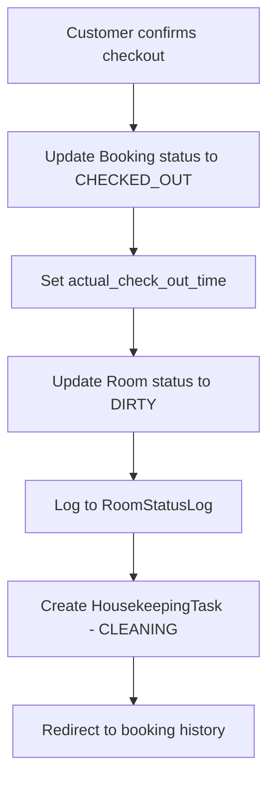
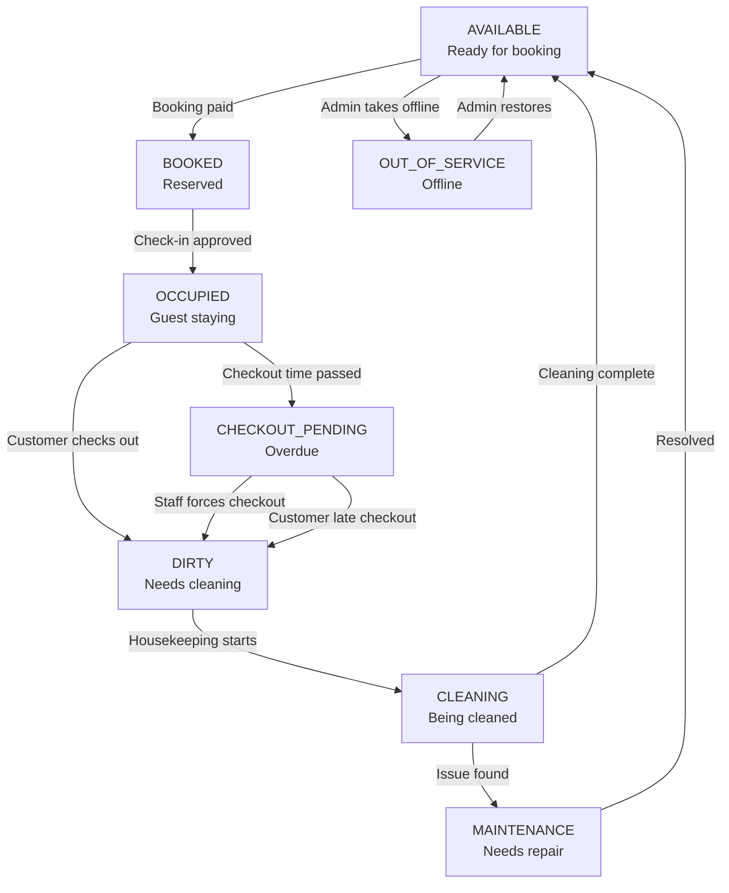
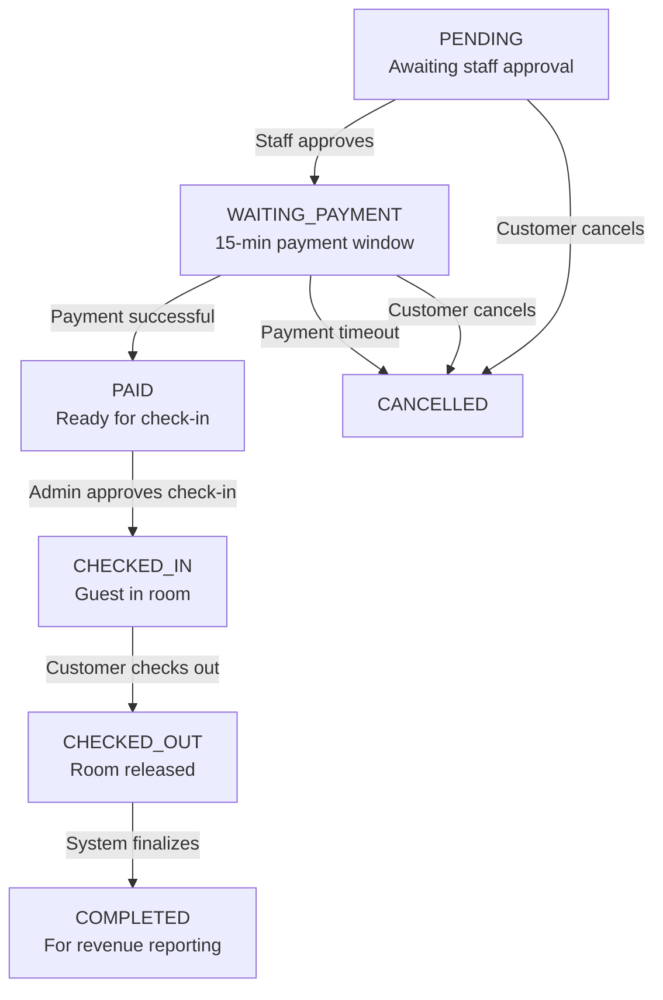
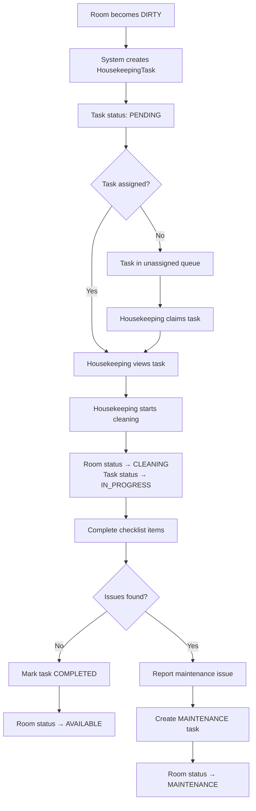
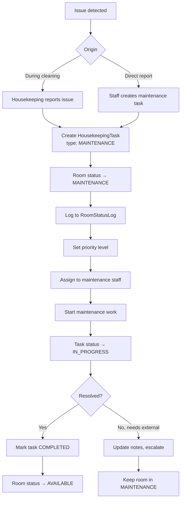
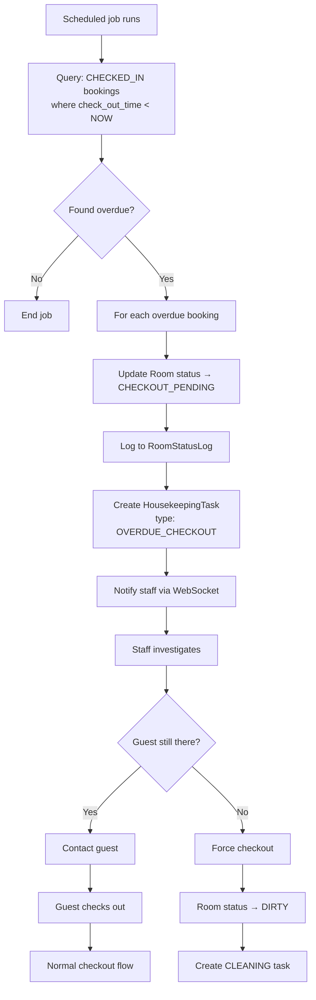
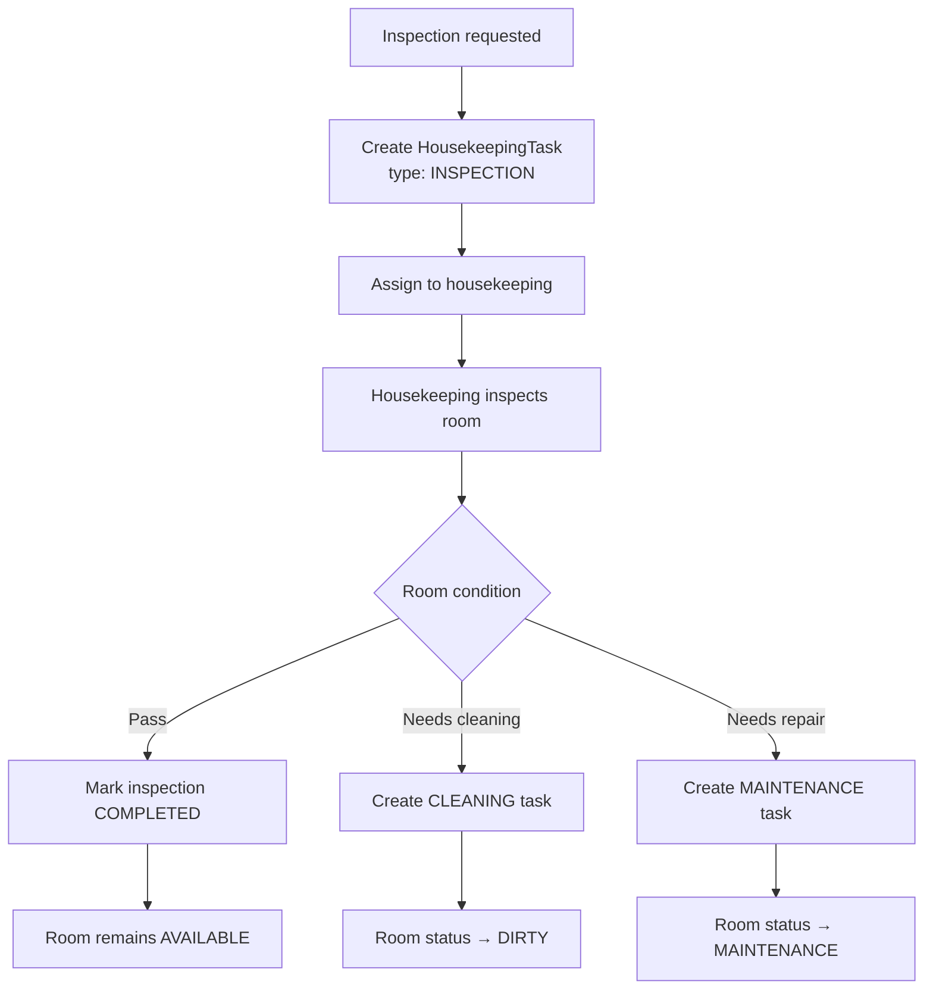

# System Workflows

## WF-01: Customer Registration

**Actors**: Customer
**Trigger**: Customer clicks "Register" on the homepage.

1. System displays the email entry form.
2. Customer enters email address.
3. System checks if email already exists in DB (`findByEmail`).
4. If email exists → display error "Email already registered."
5. System generates a random OTP code and sends it to the email via Email Service.
6. System displays the OTP verification screen.
7. Customer enters the received OTP.
8. System validates OTP matches and is within 1-minute expiry window.
9. If OTP invalid/expired → display error, offer resend.
10. System displays the registration form (full name, password, phone).
11. Customer fills in details and submits.
12. System hashes the password with BCrypt.
13. System creates a new Customer record with status `ACTIVE`, `is_deleted = 0`.
14. System redirects to login page with success message.

---

## WF-02: Customer Login (Email/Password)

**Actors**: Customer
**Trigger**: Customer navigates to the login page.

1. Customer enters email, password, and completes reCAPTCHA.
2. System sends reCAPTCHA token to Google reCAPTCHA API for verification.
3. If reCAPTCHA fails → display error.
4. System queries Customer by email (`is_deleted = 0`).
5. If customer not found → display error "Invalid credentials."
6. System compares password hash with BCrypt.
7. If password mismatch → display error.
8. System checks customer status is `ACTIVE`.
9. If inactive → display error "Account is deactivated."
10. System generates JWT Access Token.
11. System generates Refresh Token, stores it in `RefreshToken` table with `customer_id`.
12. System returns `AuthResponse` and redirects to homepage.

---

## WF-03: Google OAuth2 Login

**Actors**: Customer
**Trigger**: Customer clicks "Login with Google."

1. Customer authenticates with Google and receives an ID Token.
2. System sends ID Token to Google API for verification.
3. Google returns user info (email, name, avatar).
4. System checks if email exists in Customer table.
5. If exists → generate session (access token + refresh token), redirect to homepage.
6. If not exists → create new Customer record (email, name, avatar, status `ACTIVE`) → generate session → redirect.

---

## WF-04: Password Reset

**Actors**: Customer
**Trigger**: Customer clicks "Forgot Password" on login page.

1. Customer enters email address.
2. System verifies email exists and account is active/not deleted.
3. If not found → display error.
4. System generates OTP, sends to email, stores in session/cache.
5. Customer enters OTP code.
6. System validates OTP matches and is within 1-minute window.
7. If invalid → display error, offer resend.
8. System displays new password form.
9. Customer enters new password and confirmation.
10. System validates passwords match and meet complexity rules (8+ chars, uppercase, lowercase, number).
11. System hashes password with BCrypt.
12. System updates `password_hash` and `updated_at` in Customer table.
13. Redirect to login page.

---

## WF-05: Room Search and Filtering

**Actors**: Customer
**Trigger**: Customer visits homepage or applies filters.

1. System loads paginated room list with cover images and amenities.
2. System loads all amenities for filter sidebar.
3. Customer optionally sets price range (min/max) and selects amenity filters.
4. System sends filter criteria to backend.
5. Backend builds dynamic query with optional WHERE clauses.
6. System returns filtered, paginated room list (only rooms with status `AVAILABLE` or `BOOKED`).
7. Customer clicks on a room card.
8. System queries full room detail (all images, all amenities, type info).
9. System displays room detail page.

---

## WF-06: Room Booking

**Actors**: Customer
**Trigger**: Customer clicks "Book" on room detail page.

1. Customer selects check-in and check-out dates.
2. Customer uploads ID card front and back images.
3. Customer optionally adds a note.
4. System validates room availability for the selected dates (room not in `DIRTY`, `CLEANING`, `MAINTENANCE`, `OUT_OF_SERVICE`).
5. System calculates `total_amount` based on room type pricing and duration.
6. System generates unique `booking_code`.
7. System creates Booking record with status `PENDING`.
8. System creates corresponding Scheduler records linking booking to timetable slots.
9. System redirects to booking confirmation page.

---

## WF-07: MoMo Payment

**Actors**: Customer
**Trigger**: Customer initiates payment for a pending booking.

1. Customer selects MoMo as payment method on the booking confirmation page.
2. System validates booking status is appropriate for payment.
3. System validates the 15-minute payment window from booking creation.
4. System creates a Payment record with status `PENDING` and method `MOMO`.
5. System calls MoMo Sandbox API (`createPaymentRequest`) with order ID, amount, and description.
6. MoMo returns a payment URL/QR code.
7. System redirects customer to MoMo payment page.
8. Customer completes payment in MoMo.
9. MoMo sends callback to system's callback endpoint with payment result and signature.
10. System recalculates HMAC-SHA256 signature and compares with MoMo's signature.
11. If signature valid and payment successful:
    - Update Payment status to `SUCCESS` and set `paid_at` timestamp.
    - Update Booking status to `PAID`.
    - Update Room status to `BOOKED`.
12. If signature invalid or payment failed → log the error, Payment status remains `PENDING`.

---

## WF-08: Check-in

**Actors**: Customer (initiates), Admin (approves)
**Trigger**: Customer initiates check-in for a paid booking.

1. Customer selects a booking and uploads a check-in video.
2. System uploads video to Cloudinary, receives video URL.
3. System creates `CheckInSession` record with status `PENDING` and video URL.
4. System sends real-time notification to Admin via WebSocket (`notifyAdmin`).
5. Admin receives notification and reviews the check-in video.
6. Admin clicks "Approve" on the check-in session.
7. System updates:
   - `CheckInSession.status` → `APPROVED`
   - `CheckInSession.reviewed_by` → Admin ID
   - `CheckInSession.reviewed_at` → current timestamp
   - `Booking.booking_status` → `CHECKED_IN`
   - `Booking.actual_check_in_time` → current timestamp
   - `Room.status` → `OCCUPIED`
8. System logs room status change to `RoomStatusLog`.
9. System sends real-time notification to Customer via WebSocket (`notifyUser`).
10. Customer sees confirmation that check-in was approved.

---

## WF-09: Check-out

**Actors**: Customer
**Trigger**: Customer clicks "Check-out" on their active booking.

1. System retrieves booking and validates status is `CHECKED_IN`.
2. System validates booking belongs to the authenticated customer.
3. System displays checkout confirmation details.
4. Customer confirms checkout.
5. System updates:
   - `Booking.booking_status` → `CHECKED_OUT`
   - `Booking.actual_check_out_time` → current timestamp
   - `Room.status` → `DIRTY`
6. System logs room status change to `RoomStatusLog`.
7. System automatically creates a `HousekeepingTask` with:
   - `room_id` → the checked-out room
   - `booking_id` → the completed booking
   - `task_type` → `CLEANING`
   - `task_status` → `PENDING`
   - `priority` → `NORMAL`
8. System redirects to booking history.



---

## WF-10: Booking Status Management (Staff)

**Actors**: Staff, Admin
**Trigger**: Staff selects a booking from the booking list.

1. Staff views booking list (all bookings with pagination).
2. Staff clicks on a booking to view details (including ID card images).
3. System displays current status and available status transitions.
4. **Approve**: Staff approves a PENDING booking → status becomes `WAITING_PAYMENT`.
5. **Confirm Payment**: Staff verifies payment record exists → status becomes `PAID`, Room status becomes `BOOKED`.
6. **Approve Check-in**: Admin approves check-in → status becomes `CHECKED_IN`, Room status becomes `OCCUPIED`.
7. System persists the status change with `updated_at` timestamp.
8. System logs room status change to `RoomStatusLog` when applicable.

---

## WF-11: Room Management (Staff/Admin)

**Actors**: Staff, Admin
**Trigger**: Staff navigates to Room Management dashboard.

1. System displays all rooms with status, type, and pricing.
2. Staff can search/filter by status or room type.
3. **Add Room**: Staff enters room number and selects room type → system checks for duplicate room number → persists new room with status `AVAILABLE`.
4. **Update Room**: Staff modifies room attributes → system validates unique room number (excluding self) → persists changes.
5. **Delete Room**: Staff requests deletion → system checks for active bookings → if none, sets `is_deleted = 1` (soft delete).
6. **Set Out of Service**: Admin sets room to `OUT_OF_SERVICE` → system logs change to `RoomStatusLog`.
7. **Restore Room**: Admin restores room from `OUT_OF_SERVICE` to `AVAILABLE` → system logs change.

---

## WF-12: Feedback Management

**Actors**: Staff, Admin
**Trigger**: Staff navigates to Feedback section.

1. System displays feedback list ordered by `created_at DESC`.
2. Staff selects a feedback item to view details (rating, content, reply).
3. **Hide/Show**: Staff toggles `is_hidden` flag to control public visibility.
4. **Reply**: Staff enters reply content → system updates `content_reply` field and sets `admin_id`.

---

## WF-13: Staff Account Creation (Admin)

**Actors**: Admin
**Trigger**: Admin clicks "Create Staff Account."

1. Admin fills in email, phone, full name, password, and selects role (ADMIN/STAFF/HOUSEKEEPING).
2. System validates input format and completeness.
3. System checks email uniqueness (`existsByEmail`).
4. If duplicate → display error.
5. System hashes password with BCrypt.
6. System creates StaffAccount with status `ACTIVE`, `is_deleted = 0`.
7. Admin sees success confirmation.

---

## WF-14: User Account Management (Admin)

**Actors**: Admin
**Trigger**: Admin navigates to User Management.

1. System displays user list (customers + staff) with optional filters (role, status).
2. Admin selects a user to view full details (read-only).
3. **Activate/Deactivate**: Admin toggles user status between `ACTIVE` and `INACTIVE`.
4. System updates the status field in the corresponding table (Customer or StaffAccount).

---

## WF-15: Room Lifecycle Overview

**Actors**: System, Staff, Housekeeping, Admin
**Description**: Complete lifecycle of a room from available to occupied and back.



### Room Status Transition Rules

| # | From | To | Trigger | Actor |
|---|------|-----|---------|-------|
| T1 | `AVAILABLE` | `BOOKED` | Booking reaches PAID status | System |
| T2 | `BOOKED` | `OCCUPIED` | Admin approves check-in | Admin |
| T3 | `OCCUPIED` | `DIRTY` | Customer confirms checkout | Customer / System |
| T4 | `OCCUPIED` | `CHECKOUT_PENDING` | Scheduled job: `NOW() > check_out_time` | System (cron) |
| T5 | `CHECKOUT_PENDING` | `DIRTY` | Staff forces checkout OR customer late-checks-out | Staff / Customer |
| T6 | `DIRTY` | `CLEANING` | Housekeeping starts cleaning task | Housekeeping |
| T7 | `CLEANING` | `AVAILABLE` | Housekeeping completes all checklist items | Housekeeping |
| T8 | `CLEANING` | `MAINTENANCE` | Housekeeping reports issue during cleaning | Housekeeping |
| T9 | `MAINTENANCE` | `AVAILABLE` | Maintenance resolved by staff/housekeeping | Staff / Housekeeping |
| T10 | Any | `OUT_OF_SERVICE` | Admin takes room offline | Admin |
| T11 | `OUT_OF_SERVICE` | `AVAILABLE` | Admin restores room | Admin |

---

## WF-16: Booking Lifecycle Overview

**Actors**: Customer, Staff, Admin, System
**Description**: Complete booking lifecycle from creation to completion.



### Booking Status Transition Rules

| From | To | Trigger | Actor |
|------|----|---------|-------|
| `PENDING` | `WAITING_PAYMENT` | Staff approves booking | Staff/Admin |
| `PENDING` | `CANCELLED` | Customer cancels OR timeout | Customer/System |
| `WAITING_PAYMENT` | `PAID` | MoMo callback with valid signature | System (MoMo callback) |
| `WAITING_PAYMENT` | `CANCELLED` | Payment window expires (15 min) | System |
| `PAID` | `CHECKED_IN` | Admin approves check-in video | Admin |
| `CHECKED_IN` | `CHECKED_OUT` | Customer confirms checkout | Customer |
| `CHECKED_OUT` | `COMPLETED` | System finalizes booking | System |

---

## WF-17: Housekeeping Cleaning Workflow

**Actors**: Housekeeping, System
**Trigger**: Room status becomes `DIRTY` (after checkout or forced checkout).



### Workflow Steps

1. **Task Creation**: When checkout occurs, system automatically creates a `HousekeepingTask`:
   - `task_type = 'CLEANING'`
   - `task_status = 'PENDING'`
   - `priority = 'NORMAL'`
   - Links to `room_id` and `booking_id`

2. **Task Assignment**: Task appears in housekeeping dashboard. Can be:
   - Pre-assigned by staff to specific housekeeping member
   - Claimed by available housekeeping staff

3. **Start Cleaning**:
   - Housekeeping clicks "Start Cleaning"
   - System updates `task_status = 'IN_PROGRESS'`, `started_at = NOW()`
   - System updates Room status to `CLEANING`
   - System logs change to `RoomStatusLog`

4. **Complete Checklist**: Housekeeping marks items complete:
   - Change bedsheets
   - Clean bathroom
   - Vacuum/mop floor
   - Restock amenities
   - Check minibar
   - Inspect for damage

5. **Finish Task**:
   - If no issues: Mark task `COMPLETED`, set `completed_at`, update Room to `AVAILABLE`
   - If issues found: Create maintenance task, update Room to `MAINTENANCE`

---

## WF-18: Maintenance Workflow

**Actors**: Housekeeping, Staff, Admin
**Trigger**: Housekeeping reports damage/issue during cleaning OR staff reports issue directly.



### Workflow Steps

1. **Issue Detection**:
   - During cleaning: Housekeeping finds broken AC, leaky faucet, damaged furniture, etc.
   - Direct: Staff notices issue during inspection or from guest complaint

2. **Task Creation**:
   - `task_type = 'MAINTENANCE'`
   - `priority` based on severity: LOW, NORMAL, HIGH, URGENT
   - `notes` describe the issue
   - Room status set to `MAINTENANCE` (unbookable)

3. **Assignment & Execution**:
   - Maintenance staff assigned (or claimed)
   - Work tracked via task status and notes
   - Updates logged for audit trail

4. **Resolution**:
   - When fixed: Task marked `COMPLETED`
   - Room transitions to `AVAILABLE`
   - Full history in `RoomStatusLog`

---

## WF-19: Overdue Checkout Detection & Handling

**Actors**: System (automated), Staff
**Trigger**: Scheduled job runs every 5-15 minutes.



### Detection Query

```sql
SELECT b.booking_id, b.room_id, r.room_number
FROM Booking b
JOIN Room r ON b.room_id = r.room_id
WHERE b.booking_status = 'CHECKED_IN'
  AND r.status = 'OCCUPIED'
  AND b.check_out_time < GETDATE()
```

### Handling Process

1. **Detection**: Cron job identifies rooms past checkout time
2. **Flagging**: Room status → `CHECKOUT_PENDING`, task created
3. **Staff Action**:
   - Contact guest if reachable
   - Inspect room if guest departed without checkout
4. **Resolution**:
   - Guest performs late checkout → normal WF-09 flow
   - Staff forces checkout → Room becomes `DIRTY`, cleaning task created

---

## WF-20: Room Inspection Workflow

**Actors**: Housekeeping, Staff
**Trigger**: Quality control inspection requested OR periodic inspection schedule.



### Use Cases

1. **Post-cleaning verification**: Supervisor inspects after housekeeping reports completion
2. **Periodic inspection**: Monthly/weekly room condition checks
3. **Guest complaint follow-up**: Inspect after negative feedback
4. **Pre-VIP arrival**: Ensure premium room quality

---

## WF-21: Housekeeping Dashboard

**Actors**: Housekeeping
**Trigger**: Housekeeping staff logs in and accesses dashboard.

1. Dashboard displays summary cards:
   - Rooms needing cleaning (`DIRTY`)
   - Rooms currently being cleaned (`CLEANING`)
   - Rooms under maintenance (`MAINTENANCE`)
   - Overdue checkouts (`CHECKOUT_PENDING`)
   - My assigned tasks (filtered by `assigned_to`)

2. Housekeeping can:
   - View detailed task list by category
   - Claim unassigned tasks
   - Start/complete cleaning tasks
   - Report maintenance issues
   - Add notes to tasks
   - View room history from `RoomStatusLog`

3. Real-time updates via WebSocket when:
   - New task created (checkout occurred)
   - Task assigned to them
   - Priority escalation

### Dashboard Queries

**Rooms needing cleaning**:
```sql
SELECT r.room_id, r.room_number, rt.name AS room_type
FROM Room r
JOIN RoomType rt ON r.room_type_id = rt.room_type_id
WHERE r.status = 'DIRTY' AND r.is_deleted = 0
```

**My pending tasks**:
```sql
SELECT ht.*, r.room_number
FROM HousekeepingTask ht
JOIN Room r ON ht.room_id = r.room_id
WHERE ht.assigned_to = @staff_id
  AND ht.task_status IN ('PENDING', 'IN_PROGRESS')
ORDER BY
  CASE ht.priority WHEN 'URGENT' THEN 1 WHEN 'HIGH' THEN 2 WHEN 'NORMAL' THEN 3 ELSE 4 END,
  ht.created_at ASC
```
