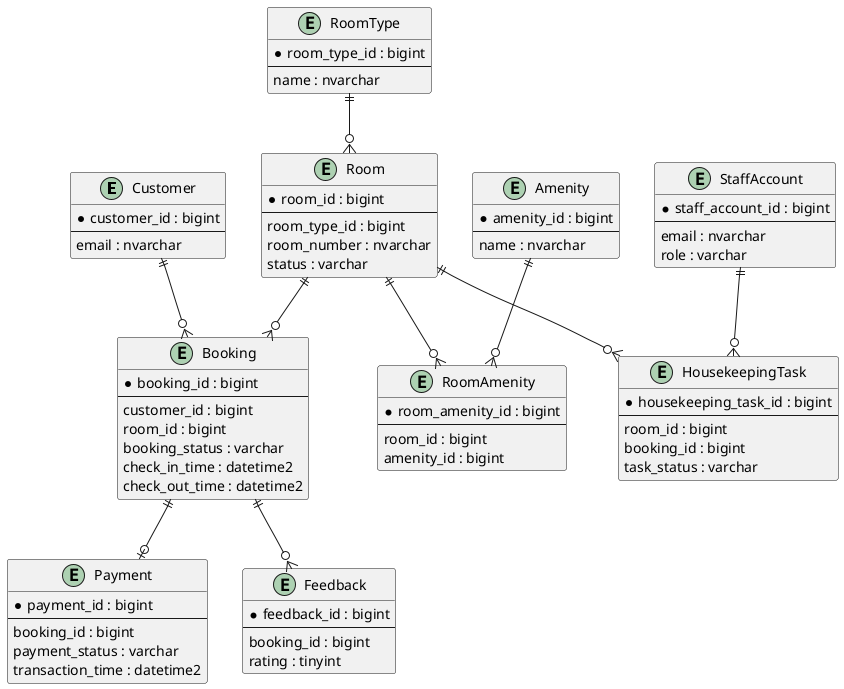

# Final Database Schema

Prepared date: 2026-03-19
Target system: BookNow Booking Homestay
Database engine: SQL Server
Design level: production-ready, 3NF-oriented, referential integrity enforced

## 1) Consolidation and refactor summary

This schema is consolidated from all project Markdown and SQL sources and resolves:

- Duplicate and conflicting booking statuses (PENDING vs WAITING_PAYMENT variants)
- Inconsistent timestamp naming (update_at vs updated_at)
- Missing status constraints in Booking and Payment
- Weak overlap protection for room bookings
- Redundant scheduling layer for booking time (Timetable/Scheduler not required for core booking integrity)
- Missing Cloudinary public_id columns for image lifecycle management

Mandatory tables preserved and optimized:

- Customer
- StaffAccount
- Room
- RoomType
- Amenity
- RoomAmenity

Design choices:

- Naming convention standardized in snake_case for columns
- Table names preserved in PascalCase where required by existing code
- All core entities include audit fields (created_at, updated_at)
- Booking lifecycle transitions enforced with transition table + trigger
- Double booking blocked by trigger + supporting index
- Media columns store both URL and Cloudinary public_id for safe update/delete operations

## 2) Final table set

Core identity and catalog:

1. Customer
2. StaffAccount
3. RoomType
4. Room
5. Amenity
6. RoomAmenity
7. RoomImage

Booking and payment:

8. Booking
9. Payment
10. BookingStatusTransition
11. BookingStatusHistory

Operational tables:

12. Feedback
13. HousekeepingTask
14. RoomStatusLog

Security/session (kept if current app still uses refresh tokens):

15. RefreshToken

Removed from core design (redundant for booking integrity):

- Timetable
- Scheduler

If slot-based reporting is required, derive slots from booking check_in_time in analytics views.

# Relationships

## 1) One-to-many

- Customer (1) -> Booking (N)
- RoomType (1) -> Room (N)
- Room (1) -> Booking (N)
- Booking (1) -> BookingStatusHistory (N)
- Booking (1) -> HousekeepingTask (N, optional)
- StaffAccount (1) -> HousekeepingTask (N) through assigned_to and created_by
- Room (1) -> RoomStatusLog (N)
- StaffAccount (1) -> RoomStatusLog (N)
- Booking (1) -> Feedback (N, business rule can limit to 1)

## 2) One-to-one

- Booking (1) -> Payment (0..1 final payment record)

## 3) Many-to-many

- Room (N) <-> (N) Amenity via RoomAmenity

## 4) Referential integrity rules

- All foreign keys are explicit
- ON DELETE NO ACTION used for transactional entities
- ON DELETE CASCADE used only where child has no standalone meaning (for example BookingStatusHistory)

# SQL DDL Script

```sql
/* =========================================================
   BOOKNOW CONSOLIDATED SCHEMA (SQL SERVER)
   ========================================================= */

/* -------------------- MASTER TABLES -------------------- */
CREATE TABLE dbo.Customer (
    customer_id       BIGINT IDENTITY(1,1) PRIMARY KEY,
    email             NVARCHAR(255) NOT NULL,
    password_hash     NVARCHAR(255) NOT NULL,
    full_name         NVARCHAR(100) NOT NULL,
    phone             NVARCHAR(20) NULL,
    avatar_url        NVARCHAR(500) NULL,
    avatar_public_id  NVARCHAR(255) NULL,
    status            VARCHAR(20) NOT NULL CONSTRAINT CK_customer_status CHECK (status IN ('ACTIVE','INACTIVE')),
    is_deleted        BIT NOT NULL CONSTRAINT DF_customer_is_deleted DEFAULT (0),
    created_at        DATETIME2(7) NOT NULL CONSTRAINT DF_customer_created_at DEFAULT SYSUTCDATETIME(),
    updated_at        DATETIME2(7) NULL,
    CONSTRAINT UQ_customer_email UNIQUE (email),
    CONSTRAINT CK_customer_avatar_cloudinary_pair CHECK (avatar_url IS NULL OR avatar_public_id IS NOT NULL)
);

CREATE TABLE dbo.StaffAccount (
    staff_account_id  BIGINT IDENTITY(1,1) PRIMARY KEY,
    email             NVARCHAR(255) NOT NULL,
    password_hash     NVARCHAR(255) NOT NULL,
    full_name         NVARCHAR(100) NOT NULL,
    phone             NVARCHAR(20) NULL,
    role              VARCHAR(20) NOT NULL CONSTRAINT CK_staff_role CHECK (role IN ('ADMIN','STAFF','HOUSEKEEPING')),
    status            VARCHAR(20) NOT NULL CONSTRAINT CK_staff_status CHECK (status IN ('ACTIVE','INACTIVE')),
    is_deleted        BIT NOT NULL CONSTRAINT DF_staff_is_deleted DEFAULT (0),
    created_at        DATETIME2(7) NOT NULL CONSTRAINT DF_staff_created_at DEFAULT SYSUTCDATETIME(),
    updated_at        DATETIME2(7) NULL,
    CONSTRAINT UQ_staff_email UNIQUE (email)
);

CREATE TABLE dbo.RoomType (
    room_type_id      BIGINT IDENTITY(1,1) PRIMARY KEY,
    name              NVARCHAR(100) NOT NULL,
    description       NVARCHAR(1000) NULL,
    base_price        DECIMAL(12,2) NOT NULL,
    over_price        DECIMAL(12,2) NULL,
    max_guests        INT NOT NULL,
    area_m2           DECIMAL(10,2) NULL,
    is_deleted        BIT NOT NULL CONSTRAINT DF_roomtype_is_deleted DEFAULT (0),
    created_at        DATETIME2(7) NOT NULL CONSTRAINT DF_roomtype_created_at DEFAULT SYSUTCDATETIME(),
    updated_at        DATETIME2(7) NULL,
    CONSTRAINT UQ_roomtype_name UNIQUE (name)
);

CREATE TABLE dbo.Room (
    room_id           BIGINT IDENTITY(1,1) PRIMARY KEY,
    room_type_id      BIGINT NOT NULL,
    room_number       NVARCHAR(50) NOT NULL,
    status            VARCHAR(20) NOT NULL
        CONSTRAINT CK_room_status CHECK (
            status IN ('AVAILABLE','BOOKED','OCCUPIED','DIRTY','CLEANING','MAINTENANCE','OUT_OF_SERVICE','INACTIVE')
        ),
    is_deleted        BIT NOT NULL CONSTRAINT DF_room_is_deleted DEFAULT (0),
    created_at        DATETIME2(7) NOT NULL CONSTRAINT DF_room_created_at DEFAULT SYSUTCDATETIME(),
    updated_at        DATETIME2(7) NULL,
    CONSTRAINT FK_room_roomtype FOREIGN KEY (room_type_id) REFERENCES dbo.RoomType(room_type_id),
    CONSTRAINT UQ_room_room_number UNIQUE (room_number),
    CONSTRAINT CK_room_number_format CHECK (room_number LIKE '[A-Z]-[A-Za-z]%-[0-9][0-9]')
);

CREATE TABLE dbo.Amenity (
    amenity_id        BIGINT IDENTITY(1,1) PRIMARY KEY,
    name              NVARCHAR(100) NOT NULL,
    icon_url          NVARCHAR(500) NULL,
    icon_public_id    NVARCHAR(255) NULL,
    is_deleted        BIT NOT NULL CONSTRAINT DF_amenity_is_deleted DEFAULT (0),
    created_at        DATETIME2(7) NOT NULL CONSTRAINT DF_amenity_created_at DEFAULT SYSUTCDATETIME(),
    updated_at        DATETIME2(7) NULL,
    CONSTRAINT UQ_amenity_name UNIQUE (name),
    CONSTRAINT CK_amenity_icon_cloudinary_pair CHECK (icon_url IS NULL OR icon_public_id IS NOT NULL)
);

CREATE TABLE dbo.RoomAmenity (
    room_amenity_id   BIGINT IDENTITY(1,1) PRIMARY KEY,
    room_id           BIGINT NOT NULL,
    amenity_id        BIGINT NOT NULL,
    created_at        DATETIME2(7) NOT NULL CONSTRAINT DF_roomamenity_created_at DEFAULT SYSUTCDATETIME(),
    CONSTRAINT FK_roomamenity_room FOREIGN KEY (room_id) REFERENCES dbo.Room(room_id),
    CONSTRAINT FK_roomamenity_amenity FOREIGN KEY (amenity_id) REFERENCES dbo.Amenity(amenity_id),
    CONSTRAINT UQ_roomamenity UNIQUE (room_id, amenity_id)
);

CREATE TABLE dbo.RoomImage (
    room_image_id     BIGINT IDENTITY(1,1) PRIMARY KEY,
    room_id           BIGINT NOT NULL,
    image_url         NVARCHAR(500) NOT NULL,
    image_public_id   NVARCHAR(255) NULL,
    is_cover          BIT NOT NULL CONSTRAINT DF_roomimage_is_cover DEFAULT (0),
    created_at        DATETIME2(7) NOT NULL CONSTRAINT DF_roomimage_created_at DEFAULT SYSUTCDATETIME(),
    CONSTRAINT FK_roomimage_room FOREIGN KEY (room_id) REFERENCES dbo.Room(room_id),
    CONSTRAINT CK_roomimage_cloudinary_pair CHECK (image_url IS NULL OR image_public_id IS NOT NULL)
);

/* -------------------- BOOKING + PAYMENT -------------------- */
CREATE TABLE dbo.Booking (
    booking_id             BIGINT IDENTITY(1,1) PRIMARY KEY,
    customer_id            BIGINT NOT NULL,
    room_id                BIGINT NOT NULL,
    approved_by_staff_id   BIGINT NULL,
    booking_code           NVARCHAR(50) NOT NULL,
    check_in_time          DATETIME2(7) NOT NULL,
    check_out_time         DATETIME2(7) NOT NULL,
    actual_check_in_time   DATETIME2(7) NULL,
    actual_check_out_time  DATETIME2(7) NULL,
    total_amount           DECIMAL(12,2) NOT NULL,
    booking_status         VARCHAR(30) NOT NULL
        CONSTRAINT CK_booking_status CHECK (
            booking_status IN (
                'PENDING_PAYMENT','PAID','APPROVED','CHECKED_IN','CHECKED_OUT','COMPLETED',
                'FAILED','CANCELED','REJECTED'
            )
        ),
    note                   NVARCHAR(500) NULL,
    created_at             DATETIME2(7) NOT NULL CONSTRAINT DF_booking_created_at DEFAULT SYSUTCDATETIME(),
    updated_at             DATETIME2(7) NULL,
    CONSTRAINT FK_booking_customer FOREIGN KEY (customer_id) REFERENCES dbo.Customer(customer_id),
    CONSTRAINT FK_booking_room FOREIGN KEY (room_id) REFERENCES dbo.Room(room_id),
    CONSTRAINT FK_booking_approved_by FOREIGN KEY (approved_by_staff_id) REFERENCES dbo.StaffAccount(staff_account_id),
    CONSTRAINT UQ_booking_code UNIQUE (booking_code),
    CONSTRAINT CK_booking_time_window CHECK (check_out_time > check_in_time)
);

CREATE TABLE dbo.Payment (
    payment_id         BIGINT IDENTITY(1,1) PRIMARY KEY,
    booking_id         BIGINT NOT NULL,
    amount             DECIMAL(12,2) NOT NULL,
    method             VARCHAR(30) NOT NULL,
    payment_status     VARCHAR(20) NOT NULL CONSTRAINT CK_payment_status CHECK (payment_status IN ('SUCCESS','FAILURE')),
    transaction_ref    NVARCHAR(100) NULL,
    transaction_time   DATETIME2(7) NOT NULL,
    created_at         DATETIME2(7) NOT NULL CONSTRAINT DF_payment_created_at DEFAULT SYSUTCDATETIME(),
    updated_at         DATETIME2(7) NULL,
    CONSTRAINT FK_payment_booking FOREIGN KEY (booking_id) REFERENCES dbo.Booking(booking_id),
    CONSTRAINT UQ_payment_booking UNIQUE (booking_id)
);

CREATE TABLE dbo.BookingStatusTransition (
    from_status        VARCHAR(30) NOT NULL,
    to_status          VARCHAR(30) NOT NULL,
    CONSTRAINT PK_booking_status_transition PRIMARY KEY (from_status, to_status)
);

CREATE TABLE dbo.BookingStatusHistory (
    booking_status_history_id BIGINT IDENTITY(1,1) PRIMARY KEY,
    booking_id                BIGINT NOT NULL,
    old_status                VARCHAR(30) NULL,
    new_status                VARCHAR(30) NOT NULL,
    changed_by_staff_id       BIGINT NULL,
    changed_at                DATETIME2(7) NOT NULL CONSTRAINT DF_bookinghistory_changed_at DEFAULT SYSUTCDATETIME(),
    reason                    NVARCHAR(500) NULL,
    CONSTRAINT FK_bookinghistory_booking FOREIGN KEY (booking_id) REFERENCES dbo.Booking(booking_id) ON DELETE CASCADE,
    CONSTRAINT FK_bookinghistory_staff FOREIGN KEY (changed_by_staff_id) REFERENCES dbo.StaffAccount(staff_account_id)
);

/* -------------------- FEEDBACK + OPERATIONS -------------------- */
CREATE TABLE dbo.Feedback (
    feedback_id         BIGINT IDENTITY(1,1) PRIMARY KEY,
    booking_id          BIGINT NOT NULL,
    replied_by_staff_id BIGINT NULL,
    rating              TINYINT NOT NULL CONSTRAINT CK_feedback_rating CHECK (rating BETWEEN 1 AND 5),
    content             NVARCHAR(1000) NOT NULL,
    content_reply       NVARCHAR(1000) NULL,
    is_hidden           BIT NOT NULL CONSTRAINT DF_feedback_is_hidden DEFAULT (0),
    created_at          DATETIME2(7) NOT NULL CONSTRAINT DF_feedback_created_at DEFAULT SYSUTCDATETIME(),
    updated_at          DATETIME2(7) NULL,
    CONSTRAINT FK_feedback_booking FOREIGN KEY (booking_id) REFERENCES dbo.Booking(booking_id),
    CONSTRAINT FK_feedback_staff FOREIGN KEY (replied_by_staff_id) REFERENCES dbo.StaffAccount(staff_account_id)
);

CREATE TABLE dbo.HousekeepingTask (
    housekeeping_task_id BIGINT IDENTITY(1,1) PRIMARY KEY,
    room_id              BIGINT NOT NULL,
    booking_id           BIGINT NULL,
    assigned_to_staff_id BIGINT NULL,
    created_by_staff_id  BIGINT NULL,
    task_type            VARCHAR(30) NOT NULL CONSTRAINT CK_task_type CHECK (task_type IN ('CLEANING','MAINTENANCE','INSPECTION','OVERDUE_CHECKOUT')),
    task_status          VARCHAR(20) NOT NULL CONSTRAINT CK_task_status CHECK (task_status IN ('PENDING','IN_PROGRESS','COMPLETED','CANCELED')),
    priority             VARCHAR(10) NOT NULL CONSTRAINT CK_task_priority CHECK (priority IN ('LOW','NORMAL','HIGH','URGENT')),
    notes                NVARCHAR(1000) NULL,
    created_at           DATETIME2(7) NOT NULL CONSTRAINT DF_hktask_created_at DEFAULT SYSUTCDATETIME(),
    started_at           DATETIME2(7) NULL,
    completed_at         DATETIME2(7) NULL,
    updated_at           DATETIME2(7) NULL,
    CONSTRAINT FK_hktask_room FOREIGN KEY (room_id) REFERENCES dbo.Room(room_id),
    CONSTRAINT FK_hktask_booking FOREIGN KEY (booking_id) REFERENCES dbo.Booking(booking_id),
    CONSTRAINT FK_hktask_assigned FOREIGN KEY (assigned_to_staff_id) REFERENCES dbo.StaffAccount(staff_account_id),
    CONSTRAINT FK_hktask_created_by FOREIGN KEY (created_by_staff_id) REFERENCES dbo.StaffAccount(staff_account_id)
);

CREATE TABLE dbo.RoomStatusLog (
    room_status_log_id   BIGINT IDENTITY(1,1) PRIMARY KEY,
    room_id              BIGINT NOT NULL,
    previous_status      VARCHAR(20) NULL,
    new_status           VARCHAR(20) NOT NULL,
    changed_by_staff_id  BIGINT NULL,
    booking_id           BIGINT NULL,
    change_reason        NVARCHAR(500) NULL,
    created_at           DATETIME2(7) NOT NULL CONSTRAINT DF_roomstatuslog_created_at DEFAULT SYSUTCDATETIME(),
    CONSTRAINT FK_roomstatuslog_room FOREIGN KEY (room_id) REFERENCES dbo.Room(room_id),
    CONSTRAINT FK_roomstatuslog_staff FOREIGN KEY (changed_by_staff_id) REFERENCES dbo.StaffAccount(staff_account_id),
    CONSTRAINT FK_roomstatuslog_booking FOREIGN KEY (booking_id) REFERENCES dbo.Booking(booking_id)
);

/* -------------------- OPTIONAL SESSION TABLE -------------------- */
CREATE TABLE dbo.RefreshToken (
    refresh_token_id     BIGINT IDENTITY(1,1) PRIMARY KEY,
    token_hash           VARCHAR(512) NOT NULL,
    customer_id          BIGINT NULL,
    staff_account_id     BIGINT NULL,
    expires_at           DATETIME2(7) NOT NULL,
    is_revoked           BIT NOT NULL CONSTRAINT DF_refreshtoken_is_revoked DEFAULT (0),
    created_at           DATETIME2(7) NOT NULL CONSTRAINT DF_refreshtoken_created_at DEFAULT SYSUTCDATETIME(),
    CONSTRAINT UQ_refreshtoken_hash UNIQUE (token_hash),
    CONSTRAINT FK_refreshtoken_customer FOREIGN KEY (customer_id) REFERENCES dbo.Customer(customer_id),
    CONSTRAINT FK_refreshtoken_staff FOREIGN KEY (staff_account_id) REFERENCES dbo.StaffAccount(staff_account_id),
    CONSTRAINT CK_refreshtoken_owner CHECK (
        (customer_id IS NOT NULL AND staff_account_id IS NULL) OR
        (customer_id IS NULL AND staff_account_id IS NOT NULL)
    )
);

/* -------------------- STATUS TRANSITION SEED -------------------- */
INSERT INTO dbo.BookingStatusTransition (from_status, to_status) VALUES
('PENDING_PAYMENT','PAID'),
('PENDING_PAYMENT','FAILED'),
('PENDING_PAYMENT','CANCELED'),
('PAID','APPROVED'),
('PAID','REJECTED'),
('PAID','CANCELED'),
('APPROVED','CHECKED_IN'),
('CHECKED_IN','CHECKED_OUT'),
('CHECKED_OUT','COMPLETED');

/* -------------------- PERFORMANCE INDEXES -------------------- */
CREATE INDEX IX_booking_room_time ON dbo.Booking(room_id, check_in_time, check_out_time);
CREATE INDEX IX_booking_status_time ON dbo.Booking(booking_status, created_at);
CREATE INDEX IX_booking_customer_time ON dbo.Booking(customer_id, created_at DESC);
CREATE INDEX IX_payment_transaction_time ON dbo.Payment(transaction_time);
CREATE INDEX IX_room_status ON dbo.Room(status) INCLUDE (room_type_id, room_number);
CREATE INDEX IX_hktask_assigned_status ON dbo.HousekeepingTask(assigned_to_staff_id, task_status);
CREATE INDEX IX_roomstatuslog_room_time ON dbo.RoomStatusLog(room_id, created_at DESC);
CREATE INDEX IX_customer_avatar_public_id ON dbo.Customer(avatar_public_id) WHERE avatar_public_id IS NOT NULL;
CREATE INDEX IX_amenity_icon_public_id ON dbo.Amenity(icon_public_id) WHERE icon_public_id IS NOT NULL;
CREATE INDEX IX_roomimage_public_id ON dbo.RoomImage(image_public_id) WHERE image_public_id IS NOT NULL;

/* -------------------- OVERLAP PREVENTION -------------------- */
GO
CREATE TRIGGER dbo.trg_booking_prevent_overlap
ON dbo.Booking
AFTER INSERT, UPDATE
AS
BEGIN
    SET NOCOUNT ON;

    IF EXISTS (
        SELECT 1
        FROM inserted i
        JOIN dbo.Booking b WITH (UPDLOCK, HOLDLOCK)
          ON b.room_id = i.room_id
         AND b.booking_id <> i.booking_id
         AND b.booking_status IN ('PENDING_PAYMENT','PAID','APPROVED','CHECKED_IN')
         AND i.booking_status IN ('PENDING_PAYMENT','PAID','APPROVED','CHECKED_IN')
         AND i.check_in_time < b.check_out_time
         AND i.check_out_time > b.check_in_time
    )
    BEGIN
        THROW 50001, 'Overlapping booking for the same room is not allowed.', 1;
    END
END;
GO

/* -------------------- BOOKING STATUS VALID TRANSITIONS -------------------- */
CREATE TRIGGER dbo.trg_booking_status_transition_guard
ON dbo.Booking
AFTER UPDATE
AS
BEGIN
    SET NOCOUNT ON;

    IF EXISTS (
        SELECT 1
        FROM inserted i
        JOIN deleted d ON i.booking_id = d.booking_id
        WHERE i.booking_status <> d.booking_status
          AND NOT EXISTS (
              SELECT 1
              FROM dbo.BookingStatusTransition t
              WHERE t.from_status = d.booking_status
                AND t.to_status = i.booking_status
          )
    )
    BEGIN
        THROW 50002, 'Invalid booking status transition.', 1;
    END;

    INSERT INTO dbo.BookingStatusHistory (booking_id, old_status, new_status, changed_at)
    SELECT i.booking_id, d.booking_status, i.booking_status, SYSUTCDATETIME()
    FROM inserted i
    JOIN deleted d ON i.booking_id = d.booking_id
    WHERE i.booking_status <> d.booking_status;
END;
GO
```

# Cloudinary Integration

## 1) Detected image-related fields

- Customer.avatar_url
- Amenity.icon_url
- RoomImage.image_url

## 2) Updated tables (DDL)

```sql
/* Customer */
ALTER TABLE dbo.Customer ADD avatar_public_id NVARCHAR(255) NULL;
ALTER TABLE dbo.Customer WITH NOCHECK
ADD CONSTRAINT CK_customer_avatar_cloudinary_pair
CHECK (avatar_url IS NULL OR avatar_public_id IS NOT NULL);

/* Amenity */
ALTER TABLE dbo.Amenity ADD icon_public_id NVARCHAR(255) NULL;
ALTER TABLE dbo.Amenity WITH NOCHECK
ADD CONSTRAINT CK_amenity_icon_cloudinary_pair
CHECK (icon_url IS NULL OR icon_public_id IS NOT NULL);

/* RoomImage */
ALTER TABLE dbo.RoomImage ADD image_public_id NVARCHAR(255) NULL;
ALTER TABLE dbo.RoomImage WITH NOCHECK
ADD CONSTRAINT CK_roomimage_cloudinary_pair
CHECK (image_url IS NULL OR image_public_id IS NOT NULL);
```

## 3) Why public_id is required

- image_url is the delivery URL used by frontend/UI to render an image.
- public_id is the Cloudinary asset identity used by backend to delete, rename, overwrite, or transform resources safely.
- Deleting by URL is not reliable; Cloudinary delete APIs require public_id.

## 4) Cloudinary fields mapping

| Table | URL Field | Public ID Field | Display Purpose | Management Purpose |
|---|---|---|---|---|
| Customer | avatar_url | avatar_public_id | Render user avatar | Delete/replace avatar in Cloudinary |
| Amenity | icon_url | icon_public_id | Render amenity icon | Delete/replace icon asset |
| RoomImage | image_url | image_public_id | Render room gallery/cover | Delete/replace room image |

## 5) Migration SQL

### Option A: Safe default

```sql
UPDATE dbo.Customer SET avatar_public_id = NULL WHERE avatar_public_id IS NULL;
UPDATE dbo.Amenity SET icon_public_id = NULL WHERE icon_public_id IS NULL;
UPDATE dbo.RoomImage SET image_public_id = NULL WHERE image_public_id IS NULL;
```

### Option B: Extract public_id from Cloudinary URL (best effort)

Assumes pattern:
https://res.cloudinary.com/<cloud>/image/upload/v123456/<public_id>.<ext>

```sql
/* Customer.avatar_url -> avatar_public_id */
UPDATE c
SET avatar_public_id =
    CASE
        WHEN c.avatar_url LIKE '%/upload/%' THEN
            REPLACE(
                LEFT(
                    SUBSTRING(c.avatar_url, CHARINDEX('/upload/', c.avatar_url) + LEN('/upload/'), 1000),
                    LEN(SUBSTRING(c.avatar_url, CHARINDEX('/upload/', c.avatar_url) + LEN('/upload/'), 1000))
                    - CHARINDEX('.', REVERSE(SUBSTRING(c.avatar_url, CHARINDEX('/upload/', c.avatar_url) + LEN('/upload/'), 1000)))
                ),
                CASE
                    WHEN SUBSTRING(c.avatar_url, CHARINDEX('/upload/', c.avatar_url) + LEN('/upload/'), 2) = 'v'
                         THEN LEFT(
                                  SUBSTRING(c.avatar_url, CHARINDEX('/upload/', c.avatar_url) + LEN('/upload/'), 50),
                                  CHARINDEX('/', SUBSTRING(c.avatar_url, CHARINDEX('/upload/', c.avatar_url) + LEN('/upload/'), 50))
                              )
                    ELSE ''
                END,
                ''
            )
        ELSE NULL
    END
FROM dbo.Customer c
WHERE c.avatar_url IS NOT NULL AND c.avatar_public_id IS NULL;

/* Amenity.icon_url -> icon_public_id */
UPDATE a
SET icon_public_id = NULL
FROM dbo.Amenity a
WHERE a.icon_url IS NOT NULL AND a.icon_public_id IS NULL;

/* RoomImage.image_url -> image_public_id */
UPDATE ri
SET image_public_id =
    CASE
        WHEN ri.image_url LIKE '%/upload/%' THEN
            SUBSTRING(
                ri.image_url,
                CHARINDEX('/upload/', ri.image_url) + LEN('/upload/'),
                LEN(ri.image_url)
            )
        ELSE NULL
    END
FROM dbo.RoomImage ri
WHERE ri.image_url IS NOT NULL AND ri.image_public_id IS NULL;
```

### Post-migration verification

```sql
SELECT 'Customer missing public_id' AS check_name, COUNT(*) AS issue_count
FROM dbo.Customer
WHERE avatar_url IS NOT NULL AND avatar_public_id IS NULL
UNION ALL
SELECT 'Amenity missing public_id', COUNT(*)
FROM dbo.Amenity
WHERE icon_url IS NOT NULL AND icon_public_id IS NULL
UNION ALL
SELECT 'RoomImage missing public_id', COUNT(*)
FROM dbo.RoomImage
WHERE image_url IS NOT NULL AND image_public_id IS NULL;
```

## 6) Service-layer workflow (recommended)

1. Upload flow:
- Upload binary to Cloudinary
- Receive secure_url + public_id
- Persist both URL and public_id in the same transaction

2. Update flow:
- Upload new asset first
- Update DB row with new URL + public_id
- Delete old Cloudinary asset using old public_id only after DB update succeeds

3. Delete flow:
- Read public_id from DB
- Call Cloudinary destroy API with public_id
- Set URL/public_id to NULL or soft-delete record based on business rule

4. Failure handling:
- If Cloudinary delete fails, keep a retry job queue keyed by public_id

## 7) Cloudinary operational best practices

- Store both URL and public_id for every media field.
- Never call Cloudinary delete without public_id.
- Keep DB and Cloudinary in sync using transactional update + async cleanup retry.
- Add filtered indexes on *_public_id for media maintenance jobs.
- Log Cloudinary request id and response in backend logs for traceability.

# Data Cleaning (Room Number Fix)

## 1) Validation rule

Target pattern for Room.room_number:

- Regex: ^[A-Z]-[A-Za-z]+-\d{2}$
- Equivalent SQL LIKE check: [A-Z]-[A-Za-z]%-[0-9][0-9]

## 2) Detection query

```sql
SELECT room_id, room_number
FROM dbo.Room
WHERE room_number NOT LIKE '[A-Z]-[A-Za-z]%-[0-9][0-9]';
```

## 3) BEFORE -> AFTER mapping (seed dataset)

All current seed values are invalid against the target regex. Proposed normalized mapping:

| room_id | BEFORE | AFTER |
|---:|---|---|
| 1 | ocean-city | A-OceanCity-01 |
| 2 | cook-and-chill | A-CookChill-02 |
| 3 | pink-paradise | A-PinkParadise-03 |
| 4 | tiger-woods | A-TigerWoods-04 |
| 5 | ball-chill | A-BallChill-05 |
| 6 | gamehub | A-GameHub-06 |
| 7 | honey-house | A-HoneyHouse-07 |
| 8 | ocean | A-Ocean-08 |
| 9 | cine-room | A-CineRoom-09 |
| 10 | ivy-graden | A-IvyGarden-10 |
| 11 | bea-bear | A-BaeBear-11 |
| 12 | wood-mood | A-WoodMood-12 |
| 13 | calm-cloud | A-CalmCloud-13 |
| 14 | bass-bar | A-BassBar-14 |
| 15 | mellow | A-Mellow-15 |
| 16 | lion-king | A-LionKing-16 |
| 17 | love-blaze | A-LoveBlaze-17 |
| 18 | squid-game | A-SquidGame-18 |
| 19 | lavender | A-Lavender-19 |
| 20 | ruby | A-RubyBida-20 |
| 21 | cinema-zone | B-CinemaZone-21 |
| 22 | solo-gaming | B-SoloGaming-22 |
| 23 | green-haven | B-GreenHaven-23 |
| 24 | zone-x | B-ZoneXBida-24 |
| 25 | my-konos | B-Mykonos-25 |
| 26 | orange-pop | B-OrangePop-26 |
| 27 | moon-space | B-MoonSpace-27 |
| 28 | cheese | B-CheeseBep-28 |
| 29 | love-pink | B-LovePink-29 |
| 30 | blue-wave | B-BlueWave-30 |
| 31 | homestay-khong-le-tan-can-tho-phong-fini-homestay-rieng-tu-lang-man-tai-can-tho-uu-dai-dac-biet | B-FiniHome-31 |
| 32 | homestay-khong-le-tan-phong-homestay-luca-tu-do-rieng-tu-tien-nghi-day-du-tai-can-tho | B-LucaHome-32 |
| 33 | homestay-khong-le-tan-phong-giong-rap-chieu-phim-cgv-cinemas-tai-can-tho-rieng-tu-hien-dai-tu-do | B-CCVCinema-33 |
| 34 | beachhomestay-can-tho-phong-phim-rieng-tu-nhu-cgv-cinemas-trai-nghiem-doc-dao-tu-do | B-Beach-34 |
| 35 | homestay-khong-le-tan-phong-homestay-sweet-dreams-tai-can-tho-thien-duong-cua-nhung-giac-mo-dep | B-SweetDreams-35 |
| 36 | homestay-khong-le-tan-homestay-phong-cach-da-lat-ngay-tai-can-tho | B-DaLat-36 |
| 37 | pink-dream | B-PinkDream-37 |
| 38 | blue-vibe | B-BlueVibe-38 |
| 39 | pure-relax | B-PureRelax-39 |
| 40 | honey-glow | B-HoneyGlow-40 |
| 41 | cgv-room | C-CGVRoom-41 |
| 42 | smoke-kitchen | C-SmokeKitchen-42 |
| 43 | 8-ball-house | C-EightBallHouse-43 |
| 44 | la-maison | C-LaMaison-44 |
| 45 | masterchef | C-MasterChef-45 |
| 46 | atlantis | C-Atlantis-46 |
| 47 | forest | C-Forest-47 |
| 48 | vibe-home | C-VibeHome-48 |
| 49 | wine-ball | C-WineBall-49 |
| 50 | video-game | C-VideoGame-50 |
| 51 | lasaoma | C-Lasaoma-51 |
| 52 | doreamon | C-Doraemon-52 |
| 53 | game-room-ps4 | C-GameRoomPS-53 |

## 4) Update script for mapping

```sql
UPDATE dbo.Room SET room_number = CASE room_id
    WHEN 1 THEN 'A-OceanCity-01'
    WHEN 2 THEN 'A-CookChill-02'
    WHEN 3 THEN 'A-PinkParadise-03'
    WHEN 4 THEN 'A-TigerWoods-04'
    WHEN 5 THEN 'A-BallChill-05'
    WHEN 6 THEN 'A-GameHub-06'
    WHEN 7 THEN 'A-HoneyHouse-07'
    WHEN 8 THEN 'A-Ocean-08'
    WHEN 9 THEN 'A-CineRoom-09'
    WHEN 10 THEN 'A-IvyGarden-10'
    WHEN 11 THEN 'A-BaeBear-11'
    WHEN 12 THEN 'A-WoodMood-12'
    WHEN 13 THEN 'A-CalmCloud-13'
    WHEN 14 THEN 'A-BassBar-14'
    WHEN 15 THEN 'A-Mellow-15'
    WHEN 16 THEN 'A-LionKing-16'
    WHEN 17 THEN 'A-LoveBlaze-17'
    WHEN 18 THEN 'A-SquidGame-18'
    WHEN 19 THEN 'A-Lavender-19'
    WHEN 20 THEN 'A-RubyBida-20'
    WHEN 21 THEN 'B-CinemaZone-21'
    WHEN 22 THEN 'B-SoloGaming-22'
    WHEN 23 THEN 'B-GreenHaven-23'
    WHEN 24 THEN 'B-ZoneXBida-24'
    WHEN 25 THEN 'B-Mykonos-25'
    WHEN 26 THEN 'B-OrangePop-26'
    WHEN 27 THEN 'B-MoonSpace-27'
    WHEN 28 THEN 'B-CheeseBep-28'
    WHEN 29 THEN 'B-LovePink-29'
    WHEN 30 THEN 'B-BlueWave-30'
    WHEN 31 THEN 'B-FiniHome-31'
    WHEN 32 THEN 'B-LucaHome-32'
    WHEN 33 THEN 'B-CCVCinema-33'
    WHEN 34 THEN 'B-Beach-34'
    WHEN 35 THEN 'B-SweetDreams-35'
    WHEN 36 THEN 'B-DaLat-36'
    WHEN 37 THEN 'B-PinkDream-37'
    WHEN 38 THEN 'B-BlueVibe-38'
    WHEN 39 THEN 'B-PureRelax-39'
    WHEN 40 THEN 'B-HoneyGlow-40'
    WHEN 41 THEN 'C-CGVRoom-41'
    WHEN 42 THEN 'C-SmokeKitchen-42'
    WHEN 43 THEN 'C-EightBallHouse-43'
    WHEN 44 THEN 'C-LaMaison-44'
    WHEN 45 THEN 'C-MasterChef-45'
    WHEN 46 THEN 'C-Atlantis-46'
    WHEN 47 THEN 'C-Forest-47'
    WHEN 48 THEN 'C-VibeHome-48'
    WHEN 49 THEN 'C-WineBall-49'
    WHEN 50 THEN 'C-VideoGame-50'
    WHEN 51 THEN 'C-Lasaoma-51'
    WHEN 52 THEN 'C-Doraemon-52'
    WHEN 53 THEN 'C-GameRoomPS-53'
END
WHERE room_id BETWEEN 1 AND 53;
```

# Time Normalization

## 1) Objective

Shift all historical time-related data to a recent window (last 30-90 days), while preserving event order:

- booking.created_at < payment.transaction_time < booking.check_in_time < booking.check_out_time
- actual_check_in_time and actual_check_out_time remain inside booking window
- no unrealistic future timestamps

## 2) Columns to normalize

- Booking: created_at, updated_at, check_in_time, check_out_time, actual_check_in_time, actual_check_out_time
- Payment: transaction_time, created_at, updated_at
- Feedback: created_at, updated_at
- HousekeepingTask: created_at, started_at, completed_at, updated_at
- RoomStatusLog: created_at

## 3) Normalization strategy

1. Compute one offset per booking record based on check_in_time relative to target anchor date.
2. Apply same offset to all booking-related rows.
3. Reconcile null/invalid sequencing after shift.
4. Clamp values to at most now minus 5 minutes to avoid future times.

## 4) SQL normalization script (idempotent-safe pattern)

```sql
DECLARE @anchor DATETIME2(7) = DATEADD(DAY, -45, SYSUTCDATETIME());

IF OBJECT_ID('tempdb..#booking_shift') IS NOT NULL DROP TABLE #booking_shift;

SELECT
    b.booking_id,
    shift_days = DATEDIFF(DAY, CAST(b.check_in_time AS DATE), CAST(@anchor AS DATE))
INTO #booking_shift
FROM dbo.Booking b;

UPDATE b
SET
    created_at = DATEADD(DAY, s.shift_days, b.created_at),
    updated_at = CASE WHEN b.updated_at IS NULL THEN NULL ELSE DATEADD(DAY, s.shift_days, b.updated_at) END,
    check_in_time = DATEADD(DAY, s.shift_days, b.check_in_time),
    check_out_time = DATEADD(DAY, s.shift_days, b.check_out_time),
    actual_check_in_time = CASE WHEN b.actual_check_in_time IS NULL THEN NULL ELSE DATEADD(DAY, s.shift_days, b.actual_check_in_time) END,
    actual_check_out_time = CASE WHEN b.actual_check_out_time IS NULL THEN NULL ELSE DATEADD(DAY, s.shift_days, b.actual_check_out_time) END
FROM dbo.Booking b
JOIN #booking_shift s ON s.booking_id = b.booking_id;

UPDATE p
SET
    transaction_time = DATEADD(DAY, s.shift_days, p.transaction_time),
    created_at = DATEADD(DAY, s.shift_days, p.created_at),
    updated_at = CASE WHEN p.updated_at IS NULL THEN NULL ELSE DATEADD(DAY, s.shift_days, p.updated_at) END
FROM dbo.Payment p
JOIN dbo.Booking b ON b.booking_id = p.booking_id
JOIN #booking_shift s ON s.booking_id = b.booking_id;

UPDATE f
SET
    created_at = DATEADD(DAY, s.shift_days, f.created_at),
    updated_at = CASE WHEN f.updated_at IS NULL THEN NULL ELSE DATEADD(DAY, s.shift_days, f.updated_at) END
FROM dbo.Feedback f
JOIN dbo.Booking b ON b.booking_id = f.booking_id
JOIN #booking_shift s ON s.booking_id = b.booking_id;

UPDATE h
SET
    created_at = DATEADD(DAY, s.shift_days, h.created_at),
    started_at = CASE WHEN h.started_at IS NULL THEN NULL ELSE DATEADD(DAY, s.shift_days, h.started_at) END,
    completed_at = CASE WHEN h.completed_at IS NULL THEN NULL ELSE DATEADD(DAY, s.shift_days, h.completed_at) END,
    updated_at = CASE WHEN h.updated_at IS NULL THEN NULL ELSE DATEADD(DAY, s.shift_days, h.updated_at) END
FROM dbo.HousekeepingTask h
JOIN dbo.Booking b ON b.booking_id = h.booking_id
JOIN #booking_shift s ON s.booking_id = b.booking_id;

/* Clamp any accidental future timestamps */
DECLARE @max_allowed DATETIME2(7) = DATEADD(MINUTE, -5, SYSUTCDATETIME());

UPDATE dbo.Booking
SET check_in_time = CASE WHEN check_in_time > @max_allowed THEN @max_allowed ELSE check_in_time END,
    check_out_time = CASE WHEN check_out_time > DATEADD(HOUR, 2, @max_allowed) THEN DATEADD(HOUR, 2, @max_allowed) ELSE check_out_time END;

/* Sequence repair */
UPDATE dbo.Booking
SET check_out_time = DATEADD(HOUR, 2, check_in_time)
WHERE check_out_time <= check_in_time;

UPDATE dbo.Payment
SET transaction_time = DATEADD(MINUTE, 10, b.created_at)
FROM dbo.Payment p
JOIN dbo.Booking b ON b.booking_id = p.booking_id
WHERE p.transaction_time < b.created_at;
```

## 5) Validation queries

```sql
/* Ensure logical order */
SELECT booking_id
FROM dbo.Booking b
LEFT JOIN dbo.Payment p ON p.booking_id = b.booking_id
WHERE NOT (
    b.created_at <= ISNULL(p.transaction_time, b.created_at)
    AND ISNULL(p.transaction_time, b.created_at) <= b.check_in_time
    AND b.check_in_time < b.check_out_time
);

/* Ensure recent window */
SELECT MIN(created_at) AS min_created_at, MAX(created_at) AS max_created_at
FROM dbo.Booking;
```

# Migration Plan

## Step-by-step execution plan

1. Baseline and backup
2. Create new schema objects in staging database
3. Load master data (Customer, StaffAccount, RoomType, Amenity)
4. Load Room with temporary nullable room_number check disabled
5. Apply room_number mapping and then enable/check constraint
6. Load RoomAmenity and RoomImage
7. Load Booking (rename update_at -> updated_at during load)
8. Load Payment and enforce booking_id uniqueness
9. Load Feedback and operational tables
10. Seed BookingStatusTransition table
11. Create transition and overlap triggers
12. Run timestamp normalization
13. Run integrity checks and reconciliation queries
14. Run cutover and enable write traffic

## Detailed migration SQL checkpoints

### A) Invalid room_number handling

- Detect invalid values
- Apply mapping table update
- Validate with zero invalid rows expected

### B) Duplicate data handling

- Customer duplicate email: keep most recent active row
- Staff duplicate email: keep active and latest created_at
- RoomAmenity duplicates: keep first row by room_amenity_id
- Booking duplicates by booking_code: keep latest updated_at

### C) Missing relationships handling

- Booking.approved_by_staff_id remains NULL for historical records where approver is unknown
- Payment without booking: quarantine rows in migration_error_payment_orphan
- Feedback without booking: quarantine rows in migration_error_feedback_orphan

### D) Old timestamps handling

- Shift to recent window with booking-linked offset
- Validate order and clamp future drift

## Post-migration quality gates

1. No orphan foreign keys across all transactional tables
2. No invalid booking_status values
3. No invalid payment_status values
4. No invalid room_number values against target regex pattern
5. No overlapping active bookings for same room
6. All mandatory tables preserved with non-zero row count

# database_remake.md (FULL CONTENT)

## System overview

BookNow is a homestay booking platform with customer booking, room inventory, payment finalization, housekeeping, and feedback operations. The remade schema prioritizes consistency, status safety, and booking integrity under concurrent writes.

## Final schema overview

- Core preserved: Customer, StaffAccount, Room, RoomType, Amenity, RoomAmenity
- Booking-centric core: Booking and Payment tightly linked
- Status safety: transition whitelist in BookingStatusTransition
- Auditability: BookingStatusHistory and RoomStatusLog
- Operations: HousekeepingTask and Feedback

## Status flows (authoritative)

Booking status flow:

PENDING_PAYMENT -> PAID -> APPROVED -> CHECKED_IN -> CHECKED_OUT -> COMPLETED

Terminal alternatives:

- PENDING_PAYMENT -> FAILED
- PENDING_PAYMENT -> CANCELED
- PAID -> REJECTED
- PAID -> CANCELED

Room status flow:

AVAILABLE -> BOOKED -> OCCUPIED -> DIRTY -> CLEANING -> AVAILABLE

Alternative states:

- MAINTENANCE
- OUT_OF_SERVICE
- INACTIVE

Payment status flow:

- SUCCESS
- FAILURE

## ERD (PlantUML)



## Data cleaning strategy summary

- Room room_number normalized using deterministic mapping to regex-compliant format.
- Booking timestamp field standardized to updated_at naming.
- Payment status constrained to SUCCESS/FAILURE.
- Transition guard trigger blocks invalid booking lifecycle jumps.

## Time normalization summary

- Historical data shifted into recent 30-90 day window.
- Event ordering preserved per booking chain.
- Future outliers clamped.

## Production hardening notes

- Keep trigger logic under integration tests for concurrency.
- Add retry-safe stored procedures for status updates and checkout transitions.
- Run migration in maintenance window with rollback snapshot.
